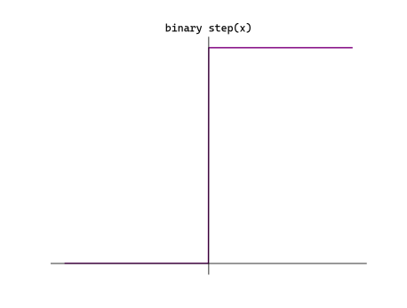
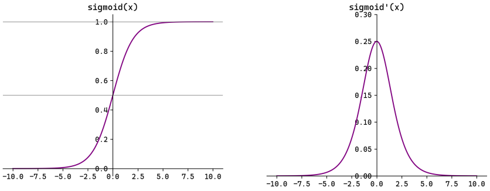
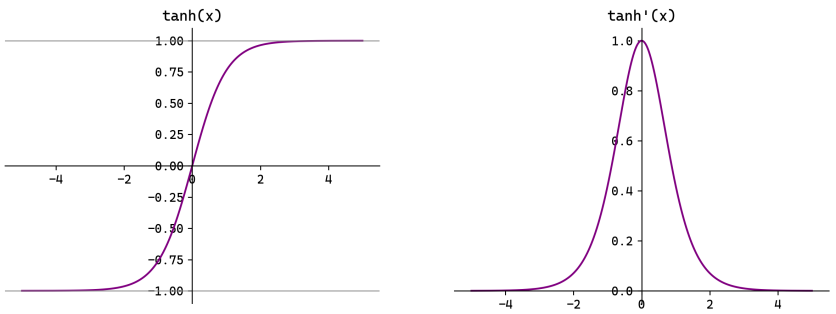
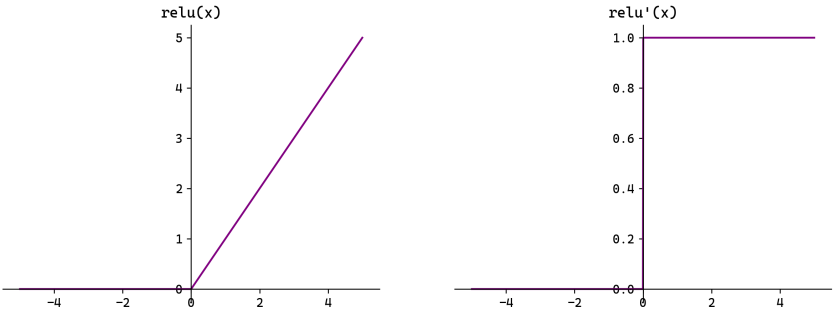
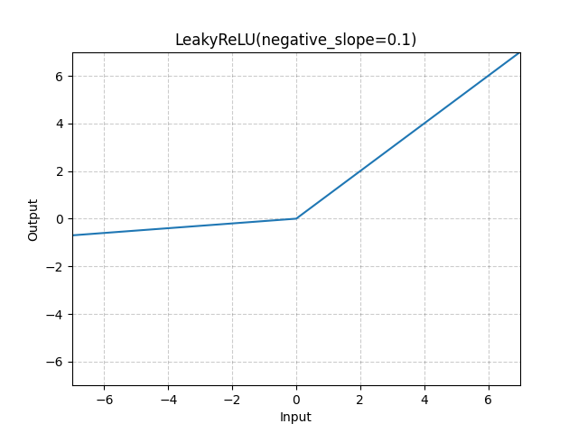

# 激活函数

> **为什么需要激活函数？** 没有激活函数，无论堆叠多少层，神经网络的数学本质依然是一次线性变换，只能解决线性可分问题。激活函数引入**非线性**，赋予网络拟合任意复杂函数的能力。

## 激活函数演进时间线

```
1957  阶跃函数（Perceptron）—— 不可导，无法反向传播
  ↓
1980s Sigmoid —— 可微，但梯度消失
  ↓
1990s Tanh —— 零中心化，但仍有梯度消失
  ↓
2011  ReLU —— 解决梯度消失，现代深度学习基石
  ↓
2013  Leaky ReLU —— 修复"神经元死亡"
  ↓
2016  PReLU / ELU —— 可学习参数，平滑负半区
  ↓
2017  GELU —— Transformer 架构的首选
  ↓
2023  SwiGLU —— LLaMA/GPT-4 等大模型主流选择
```

## 0. 线性激活（不激活）

$$f(x) = x \quad f'(x) = 1$$

**使用场景**：仅用于输出层的**回归任务**（预测房价、温度等连续值）。隐藏层绝对不用——多层线性组合退化为一层。

## 1. 阶跃函数（Step Function）

$$f(x) = \begin{cases} 1, & x \ge 0 \\ 0, & x < 0 \end{cases} \quad f'(x) = 0 \text{（几乎处处）}$$



**物理意义**：模拟生物神经元"阈值触发"行为。

**被淘汰原因**：
- $x=0$ 处不可导，其余地方导数为 0
- 反向传播链式法则在此**彻底断裂**，网络无法通过梯度下降优化

## 2. Sigmoid

$$\sigma(x) = \frac{1}{1+e^{-x}} \quad \sigma'(x) = \sigma(x)(1-\sigma(x))$$



**优点**：
- 平滑、处处可导
- 输出 $(0,1)$，可作为概率解释
- **二分类输出层的标准选择**

**缺点（隐藏层弃用原因）**：

| 问题 | 原因 |
|---|---|
| **梯度消失** | 最大导数仅 0.25；深层网络中梯度连乘趋近于 0 |
| **非零中心化** | 输出恒 > 0，导致权重只能同向更新，优化路径"Z字型"震荡 |
| **计算慢** | 指数运算耗时 |

## 3. Tanh（双曲正切）

$$\tanh(x) = \frac{e^x - e^{-x}}{e^x + e^{-x}} \quad \tanh'(x) = 1 - \tanh^2(x)$$



**改进**：解决了 Sigmoid 的非零中心化问题，输出域 $(-1, 1)$，收敛更快。

**仍有缺陷**：梯度消失问题未解决（最大导数为 1，但两端趋近于 0）。

> **使用场景**：传统 RNN 的隐藏状态激活、某些需要输出负值的场景。

## 4. ReLU（现代深度学习基石）

$$f(x) = \max(0, x) \quad f'(x) = \begin{cases} 1, & x > 0 \\ 0, & x \le 0 \end{cases}$$



**三大革命性优点**：

1. **解决正区间梯度消失**：$x>0$ 时导数恒为 1，梯度无损传递
2. **计算极快**：只有比较和赋值，无指数运算
3. **稀疏性防过拟合**：负数强制清零，每次训练只有部分神经元激活，打破协同适应

**致命缺陷：Dying ReLU（神经元死亡）**

```
如果 wx+b < 0（在所有样本上）：
  前向传播输出 0
  反向传播导数 = 0
  梯度为 0，参数永不更新
  → 该神经元彻底"死亡"
```

**触发原因**：学习率过大导致权重更新过猛，或大量负样本初始化不当。

```python
import torch
import torch.nn as nn
import numpy as np
import matplotlib.pyplot as plt

# 可视化各激活函数
x = torch.linspace(-4, 4, 200)
activations = {
    'Sigmoid': torch.sigmoid(x),
    'Tanh':    torch.tanh(x),
    'ReLU':    torch.relu(x),
    'Leaky ReLU': nn.LeakyReLU(0.1)(x),
    'GELU':    nn.GELU()(x),
}

fig, axes = plt.subplots(1, len(activations), figsize=(18, 4))
for ax, (name, y) in zip(axes, activations.items()):
    ax.plot(x.numpy(), y.detach().numpy(), 'b-', linewidth=2)
    ax.set_title(name); ax.axhline(0, color='k', linewidth=0.5)
    ax.axvline(0, color='k', linewidth=0.5); ax.grid(alpha=0.3)
plt.tight_layout(); plt.show()
```

## 5. Leaky ReLU

$$f(x) = \begin{cases} x, & x \ge 0 \\ \alpha x, & x < 0 \end{cases} \quad (\alpha \approx 0.01)$$



**核心改进**：负半区保留微弱梯度 $\alpha$，神经元不会彻底死亡，有机会被"抢救"复活。

**稀疏性保留**：$\alpha$ 极小（0.01），负区输出几乎为 0，依然保持稀疏性的抗过拟合优势。

**变种**：
- **PReLU**：$\alpha$ 作为可学习参数，由反向传播自动调整
- **ELU**：负半区使用指数曲线，更平滑

## 6. Softmax（多分类输出层）

$$\text{Softmax}(x_i) = \frac{e^{x_i}}{\sum_{j=1}^{K} e^{x_j}}$$

**作用**：将任意实数向量（Logits）转为**概率分布**（和为 1）。

```python
import torch
logits = torch.tensor([2.0, 1.0, 0.5])
probs = torch.softmax(logits, dim=0)
print(probs)  # tensor([0.6266, 0.2306, 0.1428])，总和=1
```

**注意**：PyTorch 的 `CrossEntropyLoss` 内置了 Softmax，**不要重复应用**！

## 7. GELU（Transformer 标配）

$$\text{GELU}(x) = x \cdot \Phi(x) \approx x \cdot \sigma(1.702 x)$$

其中 $\Phi(x)$ 是标准正态分布的累积分布函数。

**直觉**：GELU 是一种"随机门控"——不是像 ReLU 那样硬截断，而是根据当前值的概率大小**柔和地**决定通过多少信号。

**使用场景**：BERT、GPT 系列、ViT 等 Transformer 模型的标准隐藏层激活函数。

```python
x = torch.linspace(-4, 4, 200)
gelu = nn.GELU()(x)
relu = nn.ReLU()(x)

plt.plot(x.numpy(), gelu.numpy(), label='GELU', linewidth=2)
plt.plot(x.numpy(), relu.numpy(), label='ReLU', linewidth=2, linestyle='--')
plt.legend(); plt.grid(alpha=0.3); plt.title('GELU vs ReLU'); plt.show()
```

## 8. SwiGLU（大模型主流）

$$\text{SwiGLU}(x, W, V, b, c) = \text{Swish}(xW + b) \odot (xV + c)$$

$$\text{Swish}(x) = x \cdot \sigma(x)$$

**应用**：LLaMA、PaLM、GPT-4 等大语言模型的 FFN 层激活函数，在大规模训练中表现最优。

## 选型速查表

| 场景 | 推荐激活函数 | 原因 |
|---|---|---|
| **CNN / 一般深度网络隐藏层** | **ReLU** | 计算快，效果好 |
| **发现大量神经元死亡** | **Leaky ReLU** | 修复神经元死亡 |
| **Transformer 隐藏层** | **GELU** | Transformer 标配 |
| **大语言模型 FFN** | **SwiGLU** | LLM 最优实践 |
| **二分类输出层** | **Sigmoid** | 输出概率 [0,1] |
| **多分类输出层** | **Softmax** | 输出概率分布 |
| **回归任务输出层** | **Linear（无）** | 输出任意实数 |
| **RNN 隐藏状态** | **Tanh** | 传统 RNN 惯例 |
