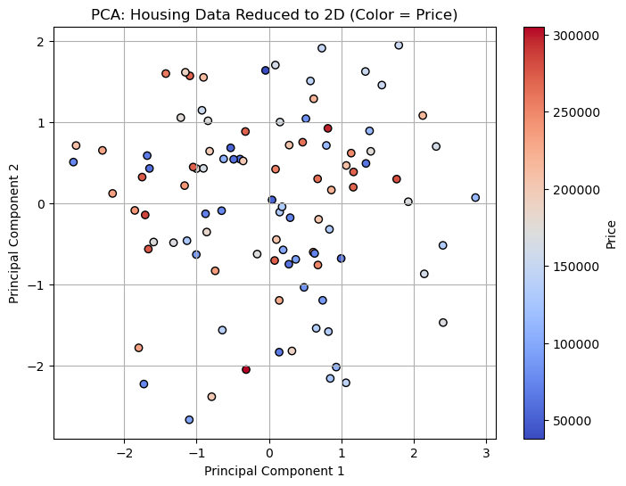
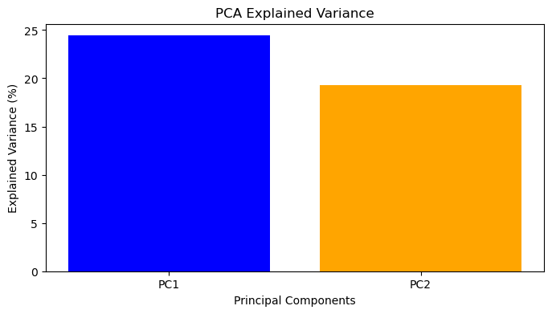

# 特征工程

> "数据和特征决定了机器学习的上限，而模型和算法只是逼近这个上限。"—— 吴恩达

## 什么是特征工程？

**特征工程（Feature Engineering）** 是将原始数据转换为更好地代表潜在问题的特征，从而提高模型预测准确性的过程。

它包括：
1. **特征选择**：从现有特征中挑选最有用的
2. **特征变换**：对特征进行数学变换
3. **特征创建**：从现有特征创造新特征
4. **特征降维**：减少特征数量

## 一、特征选择

### 1.1 过滤法 (Filter Methods)

基于统计指标选择特征，不依赖任何具体的机器学习算法：

```python
import pandas as pd
import numpy as np
from sklearn.feature_selection import SelectKBest, f_classif, chi2
from sklearn.datasets import load_iris

X, y = load_iris(return_X_y=True)

# 方差阈值：删除方差过小的特征
from sklearn.feature_selection import VarianceThreshold
selector = VarianceThreshold(threshold=0.2)
X_filtered = selector.fit_transform(X)
print(f"过滤前: {X.shape}, 过滤后: {X_filtered.shape}")

# F-检验：保留与标签最相关的 K 个特征
selector_k = SelectKBest(score_func=f_classif, k=2)
X_selected = selector_k.fit_transform(X, y)
print(f"选择后形状: {X_selected.shape}")  # (150, 2)

# 相关性分析
df = pd.DataFrame(X, columns=['sepal_l', 'sepal_w', 'petal_l', 'petal_w'])
corr_matrix = df.corr()
print(corr_matrix)
```

### 1.2 包裹法 (Wrapper Methods)

使用模型性能来评估特征子集：

```python
from sklearn.feature_selection import RFE
from sklearn.linear_model import LogisticRegression

# 递归特征消除 (RFE)
model = LogisticRegression(max_iter=1000)
rfe = RFE(estimator=model, n_features_to_select=2)
rfe.fit(X, y)

print("选择的特征:", rfe.support_)
print("特征排名:", rfe.ranking_)
```

### 1.3 嵌入法 (Embedded Methods)

在模型训练过程中进行特征选择：

```python
from sklearn.ensemble import RandomForestClassifier
import matplotlib.pyplot as plt

# 随机森林特征重要性
rf = RandomForestClassifier(n_estimators=100, random_state=42)
rf.fit(X, y)

importances = rf.feature_importances_
feature_names = ['sepal length', 'sepal width', 'petal length', 'petal width']

# 可视化
plt.barh(feature_names, importances)
plt.xlabel('Feature Importance')
plt.title('Random Forest Feature Importance')
plt.show()
```

## 二、特征变换

### 2.1 数值特征变换

```python
import numpy as np

# 对数变换（处理右偏分布，如收入、价格）
income = np.array([30000, 50000, 80000, 200000, 500000])
income_log = np.log1p(income)  # log(1 + x)，处理 0 值

# 开方变换（轻度右偏）
income_sqrt = np.sqrt(income)

# Box-Cox 变换（更通用）
from scipy import stats
income_boxcox, lambda_ = stats.boxcox(income)
print(f"最优 lambda: {lambda_:.2f}")
```

### 2.2 类别特征编码

```python
import pandas as pd
from sklearn.preprocessing import OneHotEncoder, LabelEncoder

df = pd.DataFrame({
    '城市': ['北京', '上海', '广州', '北京', '上海'],
    '学历': ['本科', '硕士', '博士', '本科', '硕士'],
    '收入': [15000, 20000, 25000, 12000, 18000]
})

# 标签编码（Label Encoding）- 适合有序类别
le = LabelEncoder()
df['学历_encoded'] = le.fit_transform(df['学历'])
# 本科→0, 博士→1, 硕士→2

# 独热编码（One-Hot Encoding）- 适合无序类别
ohe = OneHotEncoder(sparse_output=False)
city_encoded = ohe.fit_transform(df[['城市']])
# 北京→[1,0,0], 上海→[0,1,0], 广州→[0,0,1]

# pandas get_dummies（简便方式）
df_dummies = pd.get_dummies(df, columns=['城市'], prefix='city')
print(df_dummies.head())
```

### 2.3 目标编码 (Target Encoding)

高基数类别特征（如城市、用户ID）的处理：

```python
import pandas as pd
import numpy as np

def target_encode(df, col, target, smooth=10):
    """平滑目标编码"""
    global_mean = df[target].mean()
    stats = df.groupby(col)[target].agg(['mean', 'count'])
    
    # 平滑公式：(n * category_mean + smooth * global_mean) / (n + smooth)
    encoded = (stats['count'] * stats['mean'] + smooth * global_mean) / \
              (stats['count'] + smooth)
    
    return df[col].map(encoded)

# 使用示例
df['城市_te'] = target_encode(df, '城市', '收入')
```

## 三、特征降维

### 3.1 主成分分析 (PCA)



PCA 通过找到数据方差最大的方向来降维，将高维数据投影到低维空间。



```python
from sklearn.decomposition import PCA
import numpy as np
import matplotlib.pyplot as plt

# 生成高维数据
X = np.random.randn(200, 10)

# 降到2维
pca = PCA(n_components=2)
X_2d = pca.fit_transform(X)

# 查看每个主成分解释的方差比例
print("方差解释比:", pca.explained_variance_ratio_)
print("累计方差:", np.cumsum(pca.explained_variance_ratio_))

# 可视化
plt.scatter(X_2d[:, 0], X_2d[:, 1], alpha=0.6)
plt.xlabel('PC1')
plt.ylabel('PC2')
plt.title('PCA 降维结果')
plt.show()
```

**选择主成分数量**：通常保留能解释 95% 或 99% 方差的成分数量。

```python
# 自动选择解释 95% 方差的成分数
pca_auto = PCA(n_components=0.95)
X_reduced = pca_auto.fit_transform(X)
print(f"降维后维度: {X_reduced.shape}")
print(f"保留了 {pca_auto.n_components_} 个主成分")
```

### 3.2 t-SNE（可视化用）

t-SNE 专为高维数据可视化设计，将高维数据降到 2D 或 3D：

```python
from sklearn.manifold import TSNE
from sklearn.datasets import load_digits

digits = load_digits()
X, y = digits.data, digits.target

# 注意：t-SNE 计算量大，只适合可视化，不适合预处理
tsne = TSNE(n_components=2, random_state=42, perplexity=30)
X_2d = tsne.fit_transform(X[:500])  # 只用前500个样本

plt.scatter(X_2d[:, 0], X_2d[:, 1], c=y[:500], cmap='tab10')
plt.colorbar()
plt.title('Digits 数据集 t-SNE 可视化')
plt.show()
```

## 四、特征创建

### 4.1 交互特征

```python
import pandas as pd
from sklearn.preprocessing import PolynomialFeatures

# 多项式特征（捕捉非线性关系）
from sklearn.preprocessing import PolynomialFeatures

X = pd.DataFrame({'x1': [1, 2, 3], 'x2': [4, 5, 6]})
poly = PolynomialFeatures(degree=2, include_bias=False)
X_poly = poly.fit_transform(X)
# 生成: x1, x2, x1², x1*x2, x2²

# 手动创建业务特征（更有价值！）
df = pd.DataFrame({
    '身高': [170, 165, 180],
    '体重': [70, 55, 80]
})
df['BMI'] = df['体重'] / (df['身高'] / 100) ** 2
```

### 4.2 时间特征

```python
import pandas as pd

df = pd.DataFrame({'timestamp': pd.date_range('2024-01-01', periods=100, freq='h')})

# 提取时间维度特征
df['year'] = df['timestamp'].dt.year
df['month'] = df['timestamp'].dt.month
df['day'] = df['timestamp'].dt.day
df['hour'] = df['timestamp'].dt.hour
df['weekday'] = df['timestamp'].dt.dayofweek
df['is_weekend'] = df['weekday'].isin([5, 6]).astype(int)
df['quarter'] = df['timestamp'].dt.quarter
```

## 五、处理缺失值

```python
import pandas as pd
import numpy as np
from sklearn.impute import SimpleImputer, KNNImputer

df = pd.DataFrame({
    'age': [25, np.nan, 35, np.nan, 45],
    'income': [50000, 60000, np.nan, 80000, 90000],
    'city': ['北京', '上海', np.nan, '广州', '北京']
})

# 1. 简单填充
df['age'].fillna(df['age'].mean(), inplace=True)      # 均值填充
df['income'].fillna(df['income'].median(), inplace=True)  # 中位数填充
df['city'].fillna(df['city'].mode()[0], inplace=True)  # 众数填充

# 2. KNN 填充（更智能）
knn_imputer = KNNImputer(n_neighbors=3)
X_imputed = knn_imputer.fit_transform(df[['age', 'income']])

# 3. 删除缺失值
df_clean = df.dropna(subset=['age'])  # 删除 age 列有缺失的行
df_clean2 = df.dropna(thresh=2)       # 至少需要 2 个非缺失值
```

## 六、特征工程最佳实践

### 防止数据泄露

```
✅ 正确流程：
数据 → 分割（train/val/test）→ 在训练集 fit → transform 所有集合

❌ 错误流程：
数据 → fit_transform 全部数据 → 分割（信息泄露！）
```

### 特征重要性验证

构建特征后，用树模型（如 XGBoost）快速验证特征重要性，删除不重要的特征。

## 总结

| 阶段 | 工具/方法 |
|------|---------|
| 探索分析 | 相关性矩阵、分布可视化、箱线图 |
| 缺失处理 | 均值/中位数填充、KNN 填充、删除 |
| 数值变换 | 对数变换、标准化、归一化 |
| 类别编码 | One-Hot、目标编码、标签编码 |
| 特征选择 | 过滤法、递归消除、树模型重要性 |
| 降维 | PCA（预处理）、t-SNE（可视化） |
