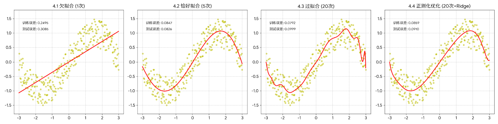

# 模型评估与选择

## 一、损失函数

损失函数（Loss Function）衡量模型预测值与真实值之间的差距，是模型优化的目标。

### 1.1 回归任务

**均方误差 (MSE)**

$$\text{MSE} = \frac{1}{n} \sum_{i=1}^{n} (y_i - \hat{y}_i)^2$$

- 对异常值敏感（因为平方）
- 优点：处处可导，方便梯度下降

**平均绝对误差 (MAE)**

$$\text{MAE} = \frac{1}{n} \sum_{i=1}^{n} |y_i - \hat{y}_i|$$

- 对异常值更鲁棒
- 缺点：在 0 处不可导

**Huber Loss**（结合两者优点）：

$$L_\delta(y, \hat{y}) = \begin{cases} \frac{1}{2}(y - \hat{y})^2 & |y - \hat{y}| \le \delta \\ \delta|y - \hat{y}| - \frac{\delta^2}{2} & |y - \hat{y}| > \delta \end{cases}$$

### 1.2 分类任务

**交叉熵损失（Cross-Entropy Loss）**

二分类：

$$L = -[y \ln(\hat{y}) + (1-y) \ln(1-\hat{y})]$$

多分类（结合 Softmax）：

$$L = -\sum_{c=1}^{C} y_c \ln(\hat{y}_c)$$

**为什么用交叉熵而不用 MSE？**

对于分类问题，MSE 会产生非凸的损失曲面（有很多局部最小值），而交叉熵产生凸的损失曲面，梯度下降更容易找到全局最优解。

```python
import numpy as np

# 交叉熵损失
def cross_entropy(y_true, y_pred):
    """二分类交叉熵"""
    epsilon = 1e-15  # 防止 log(0)
    y_pred = np.clip(y_pred, epsilon, 1 - epsilon)
    return -np.mean(y_true * np.log(y_pred) + (1 - y_true) * np.log(1 - y_pred))

# 示例
y_true = np.array([1, 0, 1, 1])
y_pred = np.array([0.9, 0.1, 0.8, 0.7])
print(f"交叉熵损失: {cross_entropy(y_true, y_pred):.4f}")
```

## 二、正则化

正则化通过在损失函数中添加惩罚项来防止过拟合。

### 2.1 L1 正则化（Lasso）

$$L_{total} = L_{data} + \lambda \sum_{j=1}^{n} |w_j|$$

**特点**：
- 产生**稀疏解**（很多参数变为 0）
- 自动进行特征选择
- 适合高维稀疏数据

### 2.2 L2 正则化（Ridge）

$$L_{total} = L_{data} + \lambda \sum_{j=1}^{n} w_j^2$$

**特点**：
- 参数趋近于 0 但不为 0
- 对多重共线性（特征高度相关）有效
- 神经网络中常用（即"权重衰减"）

### 2.3 Elastic Net（弹性网络）

$$L_{total} = L_{data} + \lambda_1 \sum |w_j| + \lambda_2 \sum w_j^2$$

结合了 L1 和 L2 的优点。

### 2.4 正则化效果对比



```python
import numpy as np
import matplotlib.pyplot as plt
from sklearn.linear_model import Ridge, Lasso, LinearRegression
from sklearn.preprocessing import PolynomialFeatures
from sklearn.pipeline import make_pipeline

# 生成数据（带噪声）
np.random.seed(42)
X = np.sort(np.random.rand(30, 1) * 10, axis=0)
y = np.sin(X).ravel() + np.random.randn(30) * 0.5

X_test = np.linspace(0, 10, 100).reshape(-1, 1)

fig, axes = plt.subplots(1, 3, figsize=(15, 4))

for ax, degree, title in zip(axes, [1, 10, 10], 
                              ['欠拟合 (度=1)', '过拟合 (度=10, 无正则化)', 
                               '正则化 (度=10, Ridge)']):
    if title.startswith('正则化'):
        model = make_pipeline(PolynomialFeatures(degree), Ridge(alpha=10))
    else:
        model = make_pipeline(PolynomialFeatures(degree), LinearRegression())
    
    model.fit(X, y)
    y_test = model.predict(X_test)
    
    ax.scatter(X, y, label='数据点', alpha=0.6)
    ax.plot(X_test, y_test, 'r-', label='拟合曲线')
    ax.set_title(title)
    ax.legend()

plt.tight_layout()
plt.show()
```

## 三、模型评估方法

### 3.1 训练集/验证集/测试集分割

```
全部数据
├── 训练集 (60-80%)  → 训练模型
├── 验证集 (10-20%)  → 调超参数
└── 测试集 (10-20%)  → 最终评估（只用一次！）
```

**⚠️ 测试集必须完全独立，不能参与任何模型选择决策！**

### 3.2 K 折交叉验证 (K-Fold Cross Validation)

将训练数据分成 K 份，每次用 K-1 份训练，1 份验证，重复 K 次取平均。

```python
from sklearn.model_selection import KFold, cross_val_score
from sklearn.linear_model import LogisticRegression
from sklearn.datasets import load_iris

X, y = load_iris(return_X_y=True)
model = LogisticRegression(max_iter=1000)

# 5 折交叉验证
kf = KFold(n_splits=5, shuffle=True, random_state=42)
scores = cross_val_score(model, X, y, cv=kf, scoring='accuracy')

print(f"各折准确率: {scores}")
print(f"平均准确率: {scores.mean():.4f} ± {scores.std():.4f}")
```

**优点**：更充分利用数据，评估更可靠（特别适合数据量少时）

**变体**：
- **分层 K 折**（StratifiedKFold）：保证每折中类别分布一致
- **留一交叉验证**（LOOCV）：每次只留一个样本验证，计算量大

### 3.3 超参数调优

```python
from sklearn.model_selection import GridSearchCV, RandomizedSearchCV
from sklearn.svm import SVC

# 网格搜索
param_grid = {
    'C': [0.1, 1, 10, 100],
    'gamma': ['scale', 'auto', 0.001, 0.01],
    'kernel': ['rbf', 'linear']
}

grid_search = GridSearchCV(
    SVC(), param_grid, cv=5, scoring='accuracy', n_jobs=-1
)
grid_search.fit(X, y)

print(f"最佳参数: {grid_search.best_params_}")
print(f"最佳得分: {grid_search.best_score_:.4f}")

# 随机搜索（更快，适合参数空间大）
from scipy.stats import uniform, randint

param_dist = {
    'C': uniform(0.1, 100),
    'gamma': uniform(0.001, 0.1),
    'kernel': ['rbf', 'linear']
}

random_search = RandomizedSearchCV(
    SVC(), param_dist, n_iter=50, cv=5, random_state=42
)
random_search.fit(X, y)
```

## 四、解析法 vs 梯度下降

对于线性回归，可以用两种方法求最优参数：

### 4.1 解析法（正规方程）

$$w^* = (X^T X)^{-1} X^T y$$

```python
import numpy as np

def linear_regression_analytical(X, y):
    """正规方程解析法"""
    # 添加偏置项
    X_b = np.column_stack([np.ones(len(X)), X])
    
    # 正规方程：w = (X^T X)^{-1} X^T y
    w = np.linalg.inv(X_b.T @ X_b) @ X_b.T @ y
    return w

X = np.array([[1], [2], [3], [4]])
y = np.array([2, 4, 6, 8])

w = linear_regression_analytical(X, y)
print(f"截距: {w[0]:.2f}, 斜率: {w[1]:.2f}")  # 截距≈0, 斜率≈2
```

**优缺点**：
- ✅ 精确解，无需调学习率
- ❌ 当特征数量很多时（如 n > 10000），$X^T X$ 求逆代价很高
- ❌ 当特征共线时，矩阵不可逆

### 4.2 梯度下降

- ✅ 适合大规模数据
- ✅ 适合复杂非线性模型（无解析解）
- ❌ 需要调整学习率
- ❌ 可能收敛到局部最优

## 五、多重共线性

**多重共线性（Multicollinearity）** 是指特征之间存在高度相关性。

**危害**：
- 参数估计不稳定，微小数据变化导致参数大幅波动
- 难以解释哪个特征对结果有影响
- 数值计算问题（矩阵接近奇异）

**检测方法**：
```python
import numpy as np
import pandas as pd

# 方差膨胀因子 (VIF)
from statsmodels.stats.outliers_influence import variance_inflation_factor

def calculate_vif(X_df):
    vif_data = pd.DataFrame()
    vif_data['feature'] = X_df.columns
    vif_data['VIF'] = [variance_inflation_factor(X_df.values, i) 
                       for i in range(len(X_df.columns))]
    return vif_data

# VIF > 10 说明有多重共线性
# VIF > 30 非常严重
```

**解决方法**：
1. 删除相关性高的特征
2. 使用 L2 正则化（Ridge Regression 对共线性有效）
3. PCA 降维，消除相关性

## 总结

| 方法 | 适用场景 |
|------|---------|
| 损失函数选择 | 回归用 MSE/Huber，分类用交叉熵 |
| L1 正则化 | 特征选择，稀疏数据 |
| L2 正则化 | 防过拟合，通用默认选择 |
| 交叉验证 | 小数据集，评估更可靠 |
| 网格搜索 | 超参数范围小时 |
| 随机搜索 | 超参数范围大时 |
