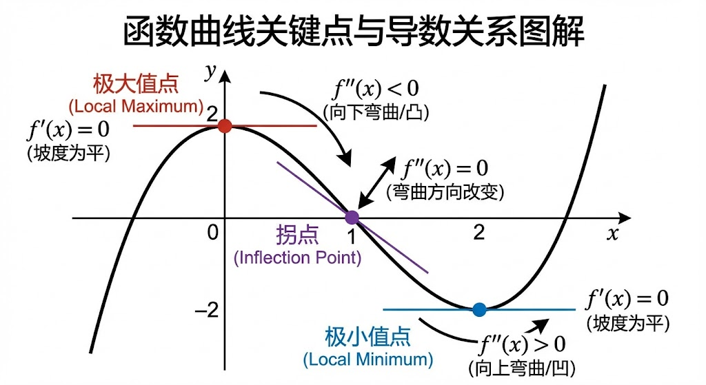

# 微积分与梯度

> 梯度下降是深度学习训练的核心引擎。理解导数和链式法则，就理解了神经网络如何学习。

## 一、导数基础

### 1.1 导数的定义

导数描述函数在某点的**变化率**：

$$f'(x) = \lim_{h \to 0} \frac{f(x + h) - f(x)}{h}$$

**直觉理解**：如果 $f(x)$ 是你走路的位置，$f'(x)$ 就是你的速度。

### 1.2 常用导数公式

| 函数 | 导数 | 备注 |
|------|------|------|
| $c$（常数） | $0$ | |
| $x^n$ | $nx^{n-1}$ | 幂函数 |
| $e^x$ | $e^x$ | 指数函数求导等于自身 |
| $\ln x$ | $\frac{1}{x}$ | 自然对数 |
| $\sin x$ | $\cos x$ | |
| $\cos x$ | $-\sin x$ | |

### 1.3 导数运算规则

**加法法则**：$(f + g)' = f' + g'$

**乘法法则**：$(fg)' = f'g + fg'$

**除法法则**：$\left(\frac{f}{g}\right)' = \frac{f'g - fg'}{g^2}$

**链式法则**（最重要！）：
$$\frac{d}{dx}[f(g(x))] = f'(g(x)) \cdot g'(x)$$

或写作：
$$\frac{dz}{dx} = \frac{dz}{dy} \cdot \frac{dy}{dx}$$

## 二、极大值与极小值



- **极大值**：函数在该点左侧递增，右侧递减，导数在该点为 0 且从正变负
- **极小值**：函数在该点左侧递减，右侧递增，导数在该点为 0 且从负变正  
- **拐点**：函数曲率改变的点，二阶导数为 0

在机器学习中，我们寻找**损失函数的极小值点**，那就是最优参数所在的地方。

### 临界点判断方法

对于函数 $f(x)$，若 $f'(x_0) = 0$：
- 若 $f''(x_0) > 0$：$x_0$ 是极小值点
- 若 $f''(x_0) < 0$：$x_0$ 是极大值点
- 若 $f''(x_0) = 0$：需进一步判断

## 三、偏导数

当函数有多个变量时，**偏导数**是对其中一个变量求导，其他变量视为常数：

$$\frac{\partial f}{\partial x_i} = \lim_{h \to 0} \frac{f(x_1, \ldots, x_i + h, \ldots, x_n) - f(x_1, \ldots, x_i, \ldots, x_n)}{h}$$

**例子**：对于 $f(x, y) = x^2 + xy + y^2$：

$$\frac{\partial f}{\partial x} = 2x + y, \quad \frac{\partial f}{\partial y} = x + 2y$$

## 四、梯度 (Gradient)

### 4.1 梯度的定义

梯度是函数对所有变量偏导数组成的向量：

$$\nabla f = \begin{bmatrix} \frac{\partial f}{\partial x_1} \\ \frac{\partial f}{\partial x_2} \\ \vdots \\ \frac{\partial f}{\partial x_n} \end{bmatrix}$$

**核心性质：梯度方向是函数增长最快的方向！**

### 4.2 梯度的直觉

想象你在山地上，梯度就像是指示"最陡上坡方向"的指针：

- 梯度方向 → 上坡最快的方向
- 负梯度方向 → 下坡最快的方向（用于梯度下降！）
- 梯度大小 → 坡度的陡峭程度

### 4.3 梯度下降

梯度下降是所有机器学习优化的核心思想：

$$\theta_{t+1} = \theta_t - \alpha \nabla_\theta L(\theta_t)$$

其中：
- $\theta$：模型参数
- $\alpha$：学习率（步长）
- $L$：损失函数
- $\nabla_\theta L$：损失函数关于参数的梯度

```python
import numpy as np

def gradient_descent(f, grad_f, x_init, lr=0.01, n_steps=100):
    """
    通用梯度下降实现
    f: 目标函数
    grad_f: 梯度函数
    x_init: 初始点
    lr: 学习率
    """
    x = x_init.copy()
    history = [x.copy()]
    
    for _ in range(n_steps):
        gradient = grad_f(x)  # 计算梯度
        x = x - lr * gradient  # 沿负梯度方向更新
        history.append(x.copy())
    
    return x, history

# 示例：最小化 f(x) = x^2
f = lambda x: x**2
grad_f = lambda x: 2*x

x_min, history = gradient_descent(f, grad_f, x_init=np.array([5.0]))
print(f"最优解: {x_min}")  # 接近 0
```

## 五、链式法则与反向传播

### 5.1 链式法则

链式法则是反向传播的数学基础。对于复合函数：

$$z = f(y),\quad y = g(x)$$

则：

$$\frac{dz}{dx} = \frac{dz}{dy} \cdot \frac{dy}{dx}$$

对于多变量，链式法则推广为：

$$\frac{\partial z}{\partial x} = \sum_j \frac{\partial z}{\partial y_j} \cdot \frac{\partial y_j}{\partial x}$$

### 5.2 反向传播示例

考虑一个简单的两层神经网络：

$$\hat{y} = \sigma(W_2 \sigma(W_1 x + b_1) + b_2)$$

反向传播计算 $\frac{\partial L}{\partial W_1}$ 的过程（链式展开）：

$$\frac{\partial L}{\partial W_1} = \frac{\partial L}{\partial \hat{y}} \cdot \frac{\partial \hat{y}}{\partial z_2} \cdot \frac{\partial z_2}{\partial h} \cdot \frac{\partial h}{\partial z_1} \cdot \frac{\partial z_1}{\partial W_1}$$

每一项都可以用链式法则逐步计算！

```python
import torch

# PyTorch 自动微分示例
x = torch.tensor([2.0], requires_grad=True)
y = x ** 2 + 3 * x + 1  # y = x² + 3x + 1

y.backward()  # 自动计算梯度
print(x.grad)  # dy/dx = 2x + 3 = 2*2 + 3 = 7
```

## 六、泰勒展开

泰勒展开可以将任何复杂函数近似为多项式：

$$f(x) \approx f(x_0) + f'(x_0)(x - x_0) + \frac{f''(x_0)}{2!}(x - x_0)^2 + \cdots$$

**特别重要的例子**：

$$e^x = 1 + x + \frac{x^2}{2!} + \frac{x^3}{3!} + \cdots = \sum_{n=0}^{\infty} \frac{x^n}{n!}$$

这个展开式是 SVM 高斯核（RBF 核）能映射到无限维空间的数学原因！

**在 XGBoost 中**，对损失函数进行二阶泰勒展开来近似求解，这使得 XGBoost 可以快速找到最优分裂点。

## 七、总结：梯度下降的变体

| 方法 | 每次使用样本数 | 特点 |
|------|-------------|------|
| 批量梯度下降 (BGD) | 全部样本 | 稳定但慢 |
| 随机梯度下降 (SGD) | 1 个样本 | 快但震荡大 |
| 小批量梯度下降 (Mini-batch GD) | 32~256 个样本 | **实际中最常用** |

$$\theta_{t+1} = \theta_t - \alpha \cdot \frac{1}{|B|} \sum_{i \in B} \nabla L_i(\theta_t)$$
