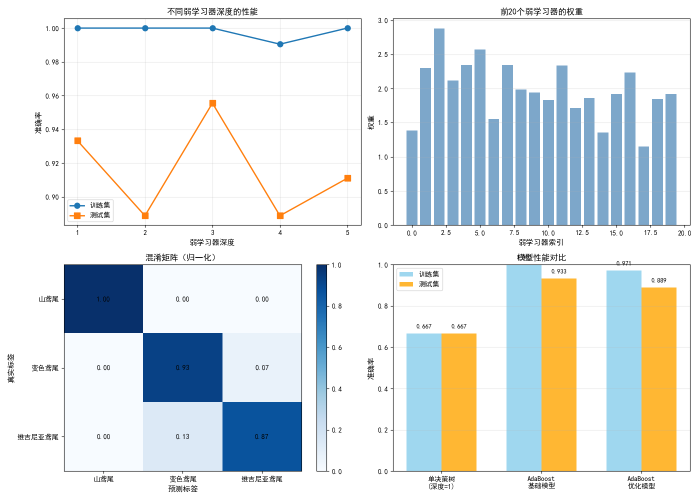
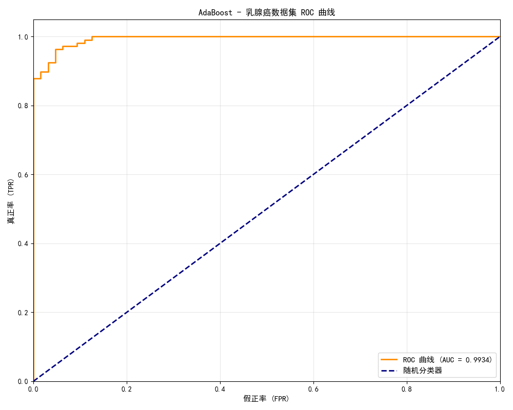

# AdaBoost

> AdaBoost 是第一个被证明有效的 Boosting 算法。它通过"专注于难例"的方式，将多个弱分类器提升为强分类器。

## 1. 核心思想

**Adaptive Boosting（AdaBoost）** 的核心：让后续的学习器**更关注被前面学习器分错的样本**。

具体实现：
1. 给每个样本分配**权重**（初始相等）
2. 训练弱分类器
3. **增加分错样本的权重，降低分对样本的权重**
4. 重复 2-3 步，最终**加权组合**所有弱分类器

## 2. 算法步骤

**初始化**：每个样本权重 $w_i = \frac{1}{N}$

**对第 $m$ 轮（$m = 1, 2, \ldots, M$）**：

1. 用加权样本训练弱分类器 $h_m(x)$

2. 计算加权错误率：
   $$\epsilon_m = \sum_{i: h_m(x_i) \ne y_i} w_i$$

3. 计算该分类器的权重（越准确权重越大）：
   $$\alpha_m = \frac{1}{2} \ln\frac{1 - \epsilon_m}{\epsilon_m}$$

4. 更新样本权重：
   $$w_i \leftarrow w_i \cdot e^{-\alpha_m y_i h_m(x_i)}$$
   
   归一化使权重之和为 1。

**最终预测**：

$$H(x) = \text{sign}\left(\sum_{m=1}^{M} \alpha_m h_m(x)\right)$$

## 3. 代码实现

```python
import numpy as np
import matplotlib.pyplot as plt
from sklearn.ensemble import AdaBoostClassifier
from sklearn.tree import DecisionTreeClassifier
from sklearn.datasets import make_classification
from sklearn.model_selection import train_test_split
from sklearn.metrics import accuracy_score

# 生成数据
X, y = make_classification(n_samples=500, n_features=10, random_state=42)
y = np.where(y == 0, -1, 1)  # 转为 -1/+1

X_train, X_test, y_train, y_test = train_test_split(X, y, test_size=0.2)

# AdaBoost（基学习器用深度为1的决策树，即"决策桩"）
ada = AdaBoostClassifier(
    estimator=DecisionTreeClassifier(max_depth=1),  # 弱分类器
    n_estimators=100,    # 弱分类器数量
    learning_rate=1.0,   # 学习率
    algorithm='SAMME',   # 多分类算法
    random_state=42
)
ada.fit(X_train, y_train)
y_pred = ada.predict(X_test)
print(f"AdaBoost 准确率: {accuracy_score(y_test, y_pred):.4f}")

# 查看随着迭代次数增加，准确率的变化
staged_scores = [accuracy_score(y_test, y_pred_s) 
                 for y_pred_s in ada.staged_predict(X_test)]

plt.figure(figsize=(10, 5))
plt.plot(range(1, len(staged_scores)+1), staged_scores, 'b-', linewidth=2)
plt.xlabel('弱分类器数量')
plt.ylabel('测试准确率')
plt.title('AdaBoost：随迭代次数增加的性能')
plt.grid(alpha=0.3)
plt.show()
```





## 4. 从零实现

```python
import numpy as np

class AdaBoost:
    def __init__(self, n_estimators=50):
        self.n_estimators = n_estimators
        self.estimators = []
        self.alphas = []
    
    def fit(self, X, y):
        n = len(y)
        weights = np.ones(n) / n  # 初始等权重
        
        for m in range(self.n_estimators):
            # 训练弱分类器（决策树桩）
            from sklearn.tree import DecisionTreeClassifier
            clf = DecisionTreeClassifier(max_depth=1)
            clf.fit(X, y, sample_weight=weights)
            y_pred = clf.predict(X)
            
            # 计算加权错误率
            incorrect = (y_pred != y)
            epsilon = np.sum(weights[incorrect])
            
            if epsilon >= 0.5:  # 弱分类器比随机猜测还差，停止
                break
            
            # 计算分类器权重
            alpha = 0.5 * np.log((1 - epsilon) / (epsilon + 1e-10))
            
            # 更新样本权重
            weights *= np.exp(-alpha * y * y_pred)
            weights /= weights.sum()  # 归一化
            
            self.estimators.append(clf)
            self.alphas.append(alpha)
        
        return self
    
    def predict(self, X):
        # 加权投票
        H = np.zeros(len(X))
        for clf, alpha in zip(self.estimators, self.alphas):
            H += alpha * clf.predict(X)
        return np.sign(H)
```

## 5. 优缺点

### 优点
- ✅ **简单且有效**：实现简单，理论保证
- ✅ **不容易过拟合**：特别是在弱分类器的情况下
- ✅ **可以用于多分类**（SAMME 变体）

### 缺点
- ❌ **对噪声和异常值敏感**：被多次增加权重，影响大
- ❌ **串行训练，速度慢**
- ❌ **在现代应用中，XGBoost/LightGBM 通常更好**

## 总结

| 特性 | AdaBoost |
|------|---------|
| **提出时间** | 1995（Freund & Schapire）|
| **核心机制** | 自适应样本权重 |
| **弱分类器** | 通常用决策树桩（深度=1）|
| **集成方式** | 加权投票 |
| **历史意义** | 第一个实用的 Boosting 算法，影响深远 |
