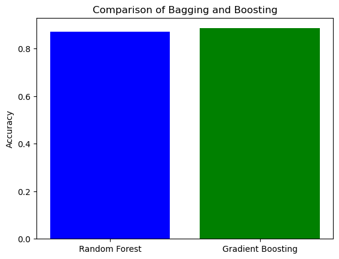

# 集成学习

> 三个臭皮匠，顶个诸葛亮。集成学习就是把多个"普通"模型组合起来，得到比任何单模型都更强的预测器。

## 什么是集成学习？

集成学习（Ensemble Learning）的核心思想：**多个模型（弱学习器）结合起来，比单个模型（强学习器）更靠谱**。

单个模型的弱点：
- 决策树容易过拟合
- 线性模型表达能力有限
- 任何模型都有偏差和方差

集成学习的优势：
- 减少过拟合（降低方差）
- 提高预测准确性
- 结果更稳定



## 三大集成方法

### 1. Bagging（自助聚合）

**并行训练，结果投票/平均**

```
原始数据
├── 随机采样 → 子集1 → 模型1 ─┐
├── 随机采样 → 子集2 → 模型2 ─┤→ 投票/平均 → 最终预测
└── 随机采样 → 子集N → 模型N ─┘
```

- **核心**：每个模型用**有放回采样**的子集训练，训练时互相独立
- **目的**：降低方差（减少过拟合）
- **代表算法**：随机森林（Random Forest）

**类比**：考试前向不同老师请教，每个老师出的题不同，综合所有练习提升成绩。

### 2. Boosting（提升法）

**串行训练，关注错误样本**

```
原始数据 → 模型1 → 错误样本增加权重
        → 模型2 → 再次找错误样本增加权重
        → ...
        → 模型N
        → 加权组合 → 最终预测
```

- **核心**：每个模型**针对前一个模型的错误**来训练
- **目的**：降低偏差（减少欠拟合，提升准确率）
- **代表算法**：AdaBoost、GBDT、XGBoost、LightGBM

**类比**：一直练习考试中做错的题，每次练习都比上一次更精准。

### 3. Stacking（堆叠）

**多层组合，元学习器**

```
训练集
├── 模型1（决策树）─┐
├── 模型2（SVM）  ─┤→ 元学习器（逻辑回归）→ 最终预测
└── 模型3（KNN）  ─┘
```

- **核心**：用"元学习器"学习如何组合多个基学习器的预测
- **代表**：Kaggle 竞赛中的高级融合技术

## 方法对比

```python
import numpy as np
from sklearn.datasets import make_classification
from sklearn.model_selection import train_test_split
from sklearn.ensemble import RandomForestClassifier, GradientBoostingClassifier
from sklearn.metrics import accuracy_score

# 生成数据集
X, y = make_classification(n_samples=1000, n_features=20, 
                           n_informative=15, n_classes=2, random_state=42)
X_train, X_test, y_train, y_test = train_test_split(X, y, test_size=0.2, random_state=42)

# 随机森林（Bagging）
rf_model = RandomForestClassifier(n_estimators=100, random_state=42)
rf_model.fit(X_train, y_train)
rf_pred = rf_model.predict(X_test)

# 梯度提升树（Boosting）
gbdt_model = GradientBoostingClassifier(n_estimators=100, learning_rate=0.1, random_state=42)
gbdt_model.fit(X_train, y_train)
gbdt_pred = gbdt_model.predict(X_test)

print(f"随机森林（Bagging）准确率: {accuracy_score(y_test, rf_pred):.4f}")
print(f"梯度提升树（Boosting）准确率: {accuracy_score(y_test, gbdt_pred):.4f}")
```

## 方法总结

| 方法 | 训练方式 | 降低 | 代表算法 | 适用情况 |
|------|---------|------|---------|---------|
| Bagging | 并行 | 方差 | 随机森林 | 模型过拟合时 |
| Boosting | 串行 | 偏差 | XGBoost、GBDT | 提升准确率 |
| Stacking | 多层 | 两者 | 元学习器 | 高精度竞赛 |

## 本章目录

| 算法 | 特点 |
|------|------|
| [随机森林](/ml-ensemble/random-forest) | 最实用的 Bagging 算法 |
| [梯度提升 GBDT](/ml-ensemble/gbdt) | Boosting 经典实现 |
| [AdaBoost](/ml-ensemble/adaboost) | 第一个实用 Boosting 算法 |
| [XGBoost](/ml-ensemble/xgboost) | 竞赛神器，工程优化极致 |
| [LightGBM](/ml-ensemble/lightgbm) | 大数据场景的高效 XGBoost |
