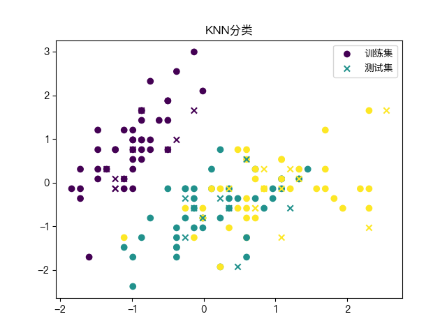

# K 近邻算法 (KNN)

> "物以类聚，人以群分"——KNN 就是这个思想的数学表达。

## 1. 核心思想

K 近邻算法（K-Nearest Neighbors，KNN）是最简单直观的机器学习算法之一：

**预测一个新样本时，找到训练集中距离它最近的 K 个样本，用它们的标签"投票"决定预测结果。**

```
新样本 ★
       ↓
找最近 K=3 个邻居
       ↓
2个是猫 🐱，1个是狗 🐶
       ↓
预测：猫 🐱（多数决定）
```

## 2. 算法步骤

1. 计算新样本与所有训练样本的距离
2. 选取距离最近的 K 个样本
3. 分类：K 个邻居中多数类的标签（投票）
4. 回归：K 个邻居的标签均值

## 3. 距离度量

### 3.1 欧氏距离（L2 距离）

$$d(p, q) = \sqrt{\sum_{i=1}^{n} (p_i - q_i)^2}$$

最常用，适合连续特征。

### 3.2 曼哈顿距离（L1 距离）

$$d(p, q) = \sum_{i=1}^{n} |p_i - q_i|$$

对异常值更鲁棒。

### 3.3 闵可夫斯基距离（通用形式）

$$d(p, q) = \left(\sum_{i=1}^{n} |p_i - q_i|^r\right)^{1/r}$$

- $r = 1$：曼哈顿距离
- $r = 2$：欧氏距离

## 4. K 值的选择

**K 值的影响**：

```
小 K（如 K=1）：
  ✅ 对局部模式敏感
  ❌ 边界不平滑，噪声影响大，容易过拟合

大 K（如 K=N）：
  ✅ 更平滑，抗噪声
  ❌ 边界过于简单，可能欠拟合
```

**选择方法**：交叉验证！

```python
from sklearn.neighbors import KNeighborsClassifier
from sklearn.model_selection import cross_val_score
import numpy as np
import matplotlib.pyplot as plt

# 测试不同 K 值
k_values = range(1, 31)
cv_scores = []

for k in k_values:
    knn = KNeighborsClassifier(n_neighbors=k)
    scores = cross_val_score(knn, X_train, y_train, cv=5, scoring='accuracy')
    cv_scores.append(scores.mean())

best_k = k_values[np.argmax(cv_scores)]
print(f"最优 K: {best_k}, 验证准确率: {max(cv_scores):.4f}")

# 可视化
plt.figure(figsize=(10, 5))
plt.plot(k_values, cv_scores, 'b-o', markersize=5)
plt.axvline(best_k, color='r', linestyle='--', label=f'最优 K={best_k}')
plt.xlabel('K 值')
plt.ylabel('交叉验证准确率')
plt.title('不同 K 值的模型性能')
plt.legend()
plt.grid(alpha=0.3)
plt.show()
```

## 5. sklearn API



```python
from sklearn.neighbors import KNeighborsClassifier, KNeighborsRegressor
from sklearn.datasets import load_iris
from sklearn.model_selection import train_test_split, GridSearchCV
from sklearn.preprocessing import StandardScaler
from sklearn.metrics import classification_report

# 加载数据
X, y = load_iris(return_X_y=True)
X_train, X_test, y_train, y_test = train_test_split(X, y, test_size=0.2, random_state=42)

# 标准化（KNN 对特征尺度敏感！）
scaler = StandardScaler()
X_train_s = scaler.fit_transform(X_train)
X_test_s = scaler.transform(X_test)

# 训练
knn = KNeighborsClassifier(n_neighbors=5, metric='euclidean', weights='uniform')
knn.fit(X_train_s, y_train)

# 评估
y_pred = knn.predict(X_test_s)
print(classification_report(y_test, y_pred, target_names=['Setosa', 'Versicolor', 'Virginica']))
```

## 6. 网格搜索和交叉验证

```python
from sklearn.model_selection import GridSearchCV
from sklearn.pipeline import Pipeline
from sklearn.preprocessing import StandardScaler
from sklearn.neighbors import KNeighborsClassifier

# 构建完整流水线
pipeline = Pipeline([
    ('scaler', StandardScaler()),
    ('knn', KNeighborsClassifier())
])

# 超参数网格
param_grid = {
    'knn__n_neighbors': [3, 5, 7, 9, 11, 15],
    'knn__weights': ['uniform', 'distance'],  # uniform:等权重, distance:距离倒数权重
    'knn__metric': ['euclidean', 'manhattan', 'minkowski']
}

# 网格搜索
grid_search = GridSearchCV(
    pipeline, 
    param_grid, 
    cv=5, 
    scoring='accuracy',
    n_jobs=-1,
    verbose=1
)
grid_search.fit(X_train, y_train)

print(f"最佳参数: {grid_search.best_params_}")
print(f"最佳得分: {grid_search.best_score_:.4f}")
print(f"测试集得分: {grid_search.score(X_test, y_test):.4f}")
```

## 7. 从零实现

```python
import numpy as np
from collections import Counter

class KNNClassifier:
    def __init__(self, k=5, metric='euclidean'):
        self.k = k
        self.metric = metric
    
    def fit(self, X, y):
        self.X_train = X
        self.y_train = y
        return self
    
    def _distance(self, x1, x2):
        if self.metric == 'euclidean':
            return np.sqrt(np.sum((x1 - x2) ** 2))
        elif self.metric == 'manhattan':
            return np.sum(np.abs(x1 - x2))
    
    def predict_one(self, x):
        # 计算到所有训练点的距离
        distances = [self._distance(x, x_train) for x_train in self.X_train]
        
        # 找最近 K 个
        k_indices = np.argsort(distances)[:self.k]
        k_labels = self.y_train[k_indices]
        
        # 投票
        return Counter(k_labels).most_common(1)[0][0]
    
    def predict(self, X):
        return np.array([self.predict_one(x) for x in X])

# 使用示例
from sklearn.datasets import make_classification
from sklearn.model_selection import train_test_split
from sklearn.preprocessing import StandardScaler

X, y = make_classification(n_samples=200, n_features=4, random_state=42)
X_train, X_test, y_train, y_test = train_test_split(X, y, test_size=0.2)

scaler = StandardScaler()
X_train_s = scaler.fit_transform(X_train)
X_test_s = scaler.transform(X_test)

knn = KNNClassifier(k=5)
knn.fit(X_train_s, y_train)
y_pred = knn.predict(X_test_s)

accuracy = np.mean(y_pred == y_test)
print(f"准确率: {accuracy:.4f}")
```

## 8. 优缺点

### 优点
- ✅ **无需训练**：训练时只需记住数据
- ✅ **简单直观**：完全基于"近邻"的逻辑
- ✅ **自然处理多分类**：天然支持多类别
- ✅ **对非线性边界有效**：不假设数据分布

### 缺点
- ❌ **预测慢**：每次预测都需计算与所有训练样本的距离，$O(nd)$
- ❌ **内存消耗大**：需要存储所有训练数据
- ❌ **维度灾难**：高维空间中距离失去意义
- ❌ **特征尺度敏感**：必须进行特征标准化

## 9. 维度灾难

在高维空间中，**所有点到测试点的距离都趋向于相等**，K 近邻失去了"近邻"的含义。

解决方案：
1. 降维（PCA、t-SNE）
2. 特征选择，去除无关特征
3. 考虑使用其他算法（SVM、神经网络）

## 总结

| 特性 | 说明 |
|------|------|
| **类型** | 懒惰学习（无显式训练过程） |
| **超参数** | K 值、距离度量方式 |
| **时间复杂度** | 预测 O(nd)，训练 O(1) |
| **适用场景** | 小数据集、低维特征、决策边界复杂 |
| **必须标准化** | 是！ |
