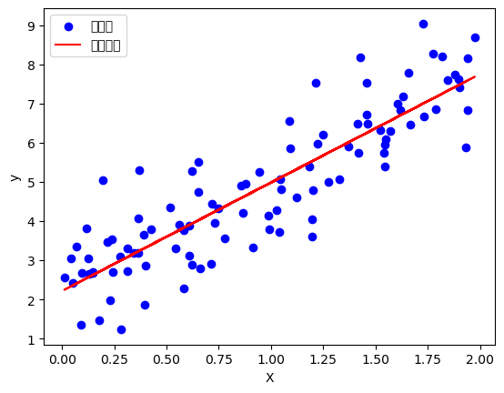
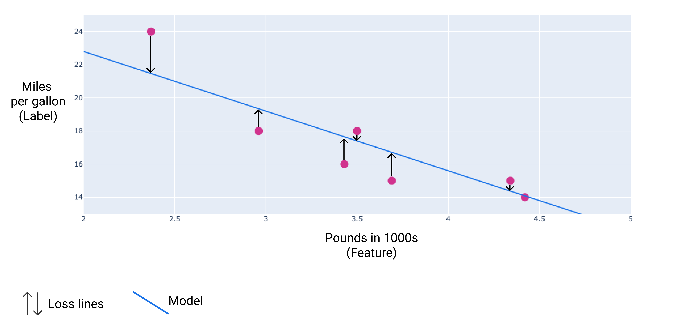
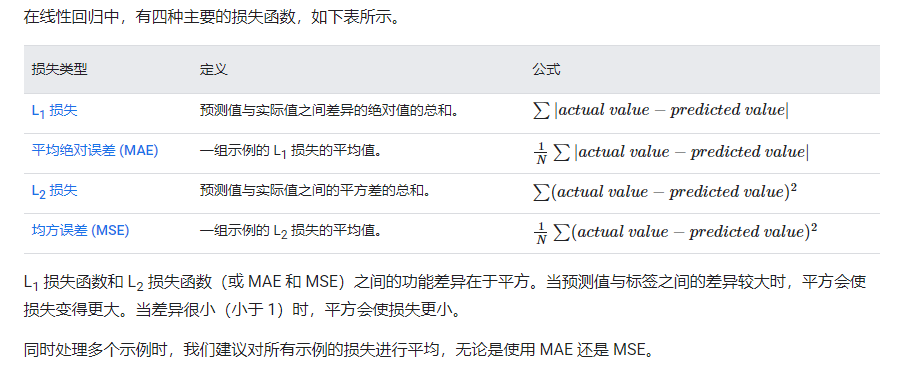
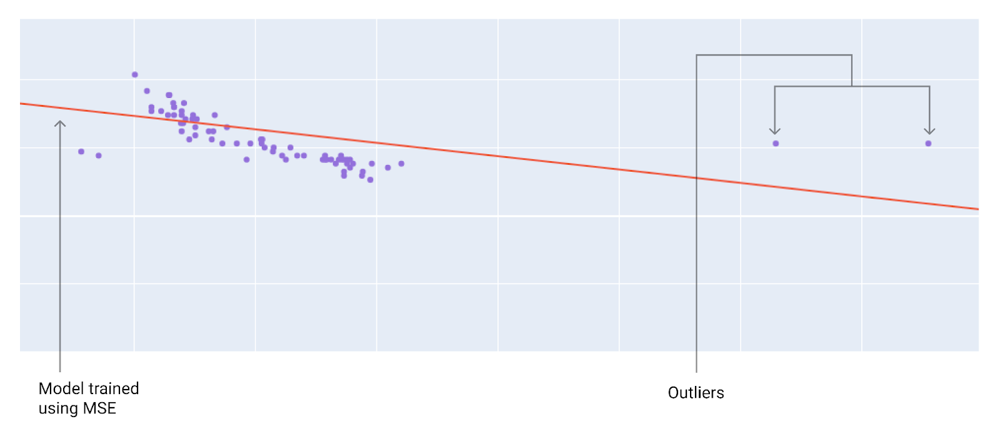

# 线性回归

## 1. 简介

线性回归是预测**连续数值型变量**的统计方法。它假设目标变量可以通过自变量（特征）的线性组合来近似表达。

**单变量线性模型**：

$$y = w_0 + w_1 x$$

**多变量线性模型**：

$$y = w_0 + w_1 x_1 + w_2 x_2 + \ldots + w_n x_n$$

其中 $w_0$ 为截距，$w_1, \ldots, w_n$ 为各特征的权重系数。

## 2. 损失函数

线性回归的目标是找到最优参数，使预测值与真实值的差异最小。

**均方误差（MSE）**：

$$\text{MSE} = \frac{1}{N} \sum_{i=1}^{N} \left(y_i - \hat{y}_i\right)^2$$



### 损失函数的几何理解







MSE 对应一个碗形（凸）曲面，梯度下降可以找到全局最小值。

## 3. 梯度下降求解

### 3.1 梯度推导

对损失函数关于参数 $w_j$ 求偏导：

$$\frac{\partial \text{MSE}}{\partial w_j} = -\frac{2}{N} \sum_{i=1}^{N} (y_i - \hat{y}_i) x_{ij}$$

### 3.2 参数更新

$$w_j \leftarrow w_j - \alpha \cdot \frac{\partial \text{MSE}}{\partial w_j}$$

### 3.3 向量化形式

$$\mathbf{w} \leftarrow \mathbf{w} - \frac{2\alpha}{N} \mathbf{X}^T (\mathbf{X}\mathbf{w} - \mathbf{y})$$

## 4. 解析解（正规方程）

对于线性回归，可以直接求得解析解：

$$\mathbf{w}^* = (\mathbf{X}^T \mathbf{X})^{-1} \mathbf{X}^T \mathbf{y}$$

**适用条件**：特征数量较少（< 10000），且 $X^TX$ 可逆

## 5. 代码实现

### 5.1 从零实现

```python
import numpy as np
import matplotlib.pyplot as plt

class LinearRegression:
    def __init__(self, lr=0.01, n_epochs=1000):
        self.lr = lr
        self.n_epochs = n_epochs
        self.weights = None
        self.bias = None
        
    def fit(self, X, y):
        m, n = X.shape
        self.weights = np.zeros(n)
        self.bias = 0
        
        losses = []
        for epoch in range(self.n_epochs):
            # 前向传播
            y_pred = X @ self.weights + self.bias
            
            # 计算损失
            loss = np.mean((y_pred - y) ** 2)
            losses.append(loss)
            
            # 计算梯度
            dw = (2/m) * X.T @ (y_pred - y)
            db = (2/m) * np.sum(y_pred - y)
            
            # 更新参数
            self.weights -= self.lr * dw
            self.bias -= self.lr * db
            
        return losses
    
    def predict(self, X):
        return X @ self.weights + self.bias

# 生成数据
np.random.seed(42)
m = 100
X = 2 * np.random.rand(m, 1)
y = 2 + 3 * X.ravel() + np.random.randn(m) * 0.5

# 训练
model = LinearRegression(lr=0.01, n_epochs=500)
losses = model.fit(X, y)
print(f"权重: {model.weights[0]:.3f}")   # 应接近 3
print(f"偏置: {model.bias:.3f}")         # 应接近 2
```

### 5.2 使用 scikit-learn

```python
from sklearn.linear_model import LinearRegression
import numpy as np
import matplotlib.pyplot as plt

# 生成数据
np.random.seed(42)
m = 100
X = 2 * np.random.rand(m, 1)
y = 2 + 3 * X + np.random.randn(m, 1)

# 训练
lin_reg = LinearRegression()
lin_reg.fit(X, y)

print(f"截距：{lin_reg.intercept_[0]:.3f}")    # ≈ 2
print(f"斜率：{lin_reg.coef_[0][0]:.3f}")      # ≈ 3

# 预测
y_pred = lin_reg.predict(X)

# 可视化
plt.figure(figsize=(8, 5))
plt.scatter(X, y, color="blue", alpha=0.5, label="数据点")
plt.plot(X, y_pred, color="red", linewidth=2, label="拟合直线")
plt.xlabel("X")
plt.ylabel("y")
plt.legend()
plt.title("线性回归")
plt.show()
```

## 6. 梯度 (Gradient) 详解

**梯度**是函数在某点沿各维度偏导数组成的向量：

$$\nabla_\mathbf{w} L = \begin{bmatrix} \frac{\partial L}{\partial w_1} \\ \frac{\partial L}{\partial w_2} \\ \vdots \\ \frac{\partial L}{\partial w_n} \end{bmatrix}$$

对于 MSE 损失：

$$\nabla_\mathbf{w} L = \frac{2}{N} \mathbf{X}^T (\mathbf{X}\mathbf{w} - \mathbf{y})$$

```python
def compute_gradient(X, y, w, b):
    """计算 MSE 损失的梯度"""
    m = len(y)
    y_pred = X @ w + b
    error = y_pred - y
    
    dw = (2/m) * X.T @ error
    db = (2/m) * np.sum(error)
    return dw, db
```

## 7. 学习率的影响

```python
import numpy as np
import matplotlib.pyplot as plt

def gradient_descent_1d(lr, n_steps=30):
    """可视化不同学习率的梯度下降"""
    # f(w) = w^2，最小值在 w=0
    w = 5.0
    history = [w]
    
    for _ in range(n_steps):
        grad = 2 * w  # f'(w) = 2w
        w = w - lr * grad
        history.append(w)
    
    return history

fig, axes = plt.subplots(1, 3, figsize=(15, 4))
learning_rates = [0.1, 0.5, 1.1]
titles = ['合适的学习率 (α=0.1)', '大学习率 (α=0.5)', '过大学习率 (α=1.1)']

for ax, lr, title in zip(axes, learning_rates, titles):
    history = gradient_descent_1d(lr)
    ax.plot(history, 'b-o', markersize=4)
    ax.axhline(y=0, color='r', linestyle='--', label='最优解')
    ax.set_title(title)
    ax.set_xlabel('迭代次数')
    ax.set_ylabel('参数值 w')
    ax.legend()

plt.tight_layout()
plt.show()
```

## 8. 多元线性回归

```python
import pandas as pd
from sklearn.linear_model import LinearRegression
from sklearn.model_selection import train_test_split
from sklearn.preprocessing import StandardScaler
from sklearn.metrics import mean_squared_error, r2_score
import numpy as np

# 波士顿房价数据（示例特征）
np.random.seed(42)
n = 1000
X = np.column_stack([
    np.random.randn(n) * 100 + 1500,  # 面积（㎡）
    np.random.randint(1, 6, n),        # 卧室数量
    np.random.randint(1, 50, n),       # 楼层
    np.random.randint(1990, 2024, n)   # 建成年份
])
y = 0.5 * X[:, 0] + 3000 * X[:, 1] - 200 * X[:, 2] + 100 * (X[:, 3] - 1990) + np.random.randn(n) * 10000

# 数据分割
X_train, X_test, y_train, y_test = train_test_split(X, y, test_size=0.2, random_state=42)

# 标准化
scaler = StandardScaler()
X_train_s = scaler.fit_transform(X_train)
X_test_s = scaler.transform(X_test)

# 训练
model = LinearRegression()
model.fit(X_train_s, y_train)

# 评估
y_pred = model.predict(X_test_s)
print(f"RMSE: {mean_squared_error(y_test, y_pred)**0.5:.2f}")
print(f"R²:   {r2_score(y_test, y_pred):.4f}")
```

## 9. 总结

| 特性 | 说明 |
|------|------|
| **任务类型** | 回归（连续值预测） |
| **模型假设** | 特征与目标呈线性关系 |
| **优化方法** | 梯度下降 / 正规方程 |
| **损失函数** | MSE（均方误差） |
| **优点** | 简单、可解释、计算快 |
| **缺点** | 无法捕捉非线性关系 |
| **正则化版本** | Ridge（L2）、Lasso（L1）、Elastic Net |
