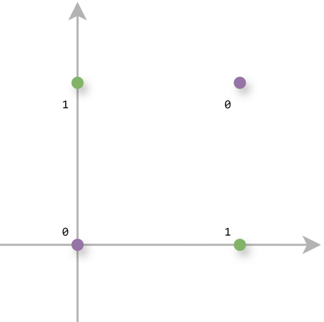
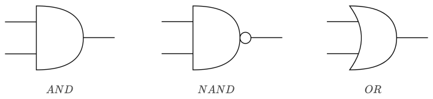
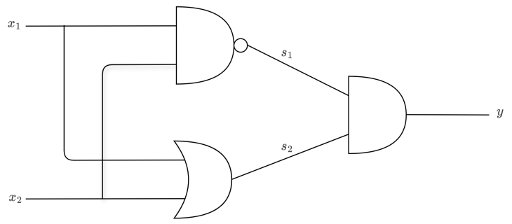

# 感知机

> 感知机是神经网络的起源，是所有深度学习的祖先模型。

## 1. 什么是感知机？

感知机（Perceptron）是 1957 年由 Frank Rosenblatt 提出的最早的机器学习模型之一，也是**单层神经网络**。

它模拟了生物神经元的工作方式：接收多个输入信号，进行加权求和，当超过某个阈值时"激活"并输出信号。



## 2. 感知机结构



**计算过程**：

$$z = w_1 x_1 + w_2 x_2 + \ldots + w_n x_n + b = \mathbf{w}^T \mathbf{x} + b$$

$$\hat{y} = \text{sign}(z) = \begin{cases} +1 & z \ge 0 \\ -1 & z < 0 \end{cases}$$

## 3. 感知机学习算法

感知机通过迭代更新参数来学习：

**当预测错误时**（$\hat{y}_i \ne y_i$）：

$$w \leftarrow w + \alpha \cdot y_i \cdot x_i$$

$$b \leftarrow b + \alpha \cdot y_i$$

**直觉**：如果预测为 -1 但实际是 +1，说明 $w^T x + b < 0$，需要把 w 向 x 方向移动。

```python
import numpy as np

class Perceptron:
    def __init__(self, lr=0.01, n_epochs=100):
        self.lr = lr
        self.n_epochs = n_epochs
        self.weights = None
        self.bias = None
    
    def fit(self, X, y):
        n_samples, n_features = X.shape
        self.weights = np.zeros(n_features)
        self.bias = 0
        
        for epoch in range(self.n_epochs):
            errors = 0
            for x_i, y_i in zip(X, y):
                # 预测
                z = np.dot(x_i, self.weights) + self.bias
                y_pred = 1 if z >= 0 else -1
                
                # 只在预测错误时更新
                if y_pred != y_i:
                    self.weights += self.lr * y_i * x_i
                    self.bias += self.lr * y_i
                    errors += 1
            
            if errors == 0:
                print(f"在第 {epoch+1} 轮收敛")
                break
    
    def predict(self, X):
        z = np.dot(X, self.weights) + self.bias
        return np.where(z >= 0, 1, -1)

# 测试：线性可分数据
from sklearn.datasets import make_classification
from sklearn.preprocessing import StandardScaler

X, y = make_classification(n_samples=100, n_features=2, n_informative=2,
                            n_redundant=0, random_state=42)
y = np.where(y == 0, -1, 1)  # 转换标签为 -1/+1

scaler = StandardScaler()
X_scaled = scaler.fit_transform(X)

perceptron = Perceptron(lr=0.1, n_epochs=100)
perceptron.fit(X_scaled, y)
y_pred = perceptron.predict(X_scaled)
print(f"准确率: {(y_pred == y).mean():.4f}")
```

## 4. 感知机与神经网络



感知机是单层网络，通过堆叠多个感知机就能构建**多层感知机（MLP）**，即现代神经网络：

```
单个感知机 → 线性分类器
多层感知机 → 可以学习非线性决策边界（通用近似定理）
```

## 5. 收敛定理

**感知机收敛定理**：如果数据是**线性可分**的，感知机算法一定会在有限步内收敛。

**局限性**：如果数据不是线性可分的（如 XOR 问题），感知机永远不会收敛！

这个局限性在 1960 年代曾导致 AI 研究陷入低潮，直到多层神经网络+反向传播的发明。

## 6. XOR 问题

感知机无法解决 XOR（异或）问题，因为 XOR 不是线性可分的：

```
输入:  (0,0) → 0
      (0,1) → 1
      (1,0) → 1
      (1,1) → 0
```

这四个点无法用一条直线分开！需要**两层网络（隐藏层）**才能解决。

```python
import numpy as np

# XOR 数据
X = np.array([[0, 0], [0, 1], [1, 0], [1, 1]])
y = np.array([0, 1, 1, 0])

# 感知机失败（无法收敛）
# 需要多层感知机（MLP）
from sklearn.neural_network import MLPClassifier

mlp = MLPClassifier(hidden_layer_sizes=(4,), activation='relu', max_iter=1000)
mlp.fit(X, y)
print("MLP 解决 XOR:", mlp.predict(X))  # [0 1 1 0]
```

## 7. 历史意义

| 年代 | 事件 |
|------|------|
| 1957 | Rosenblatt 提出感知机 |
| 1960 | ADALINE（连续输出的感知机变体）|
| 1969 | Minsky 证明感知机无法解决 XOR，AI 寒冬 |
| 1986 | 反向传播算法使多层网络成为可能 |
| 2006+ | 深度学习复兴，感知机的"孙辈"成为主流 |

## 总结

| 特性 | 感知机 |
|------|--------|
| **类型** | 线性二分类器 |
| **激活函数** | 符号函数（Sign）|
| **收敛条件** | 数据线性可分 |
| **局限性** | 无法处理非线性问题 |
| **历史地位** | 所有神经网络的起源 |
