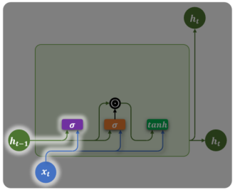
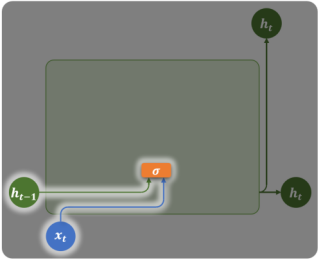
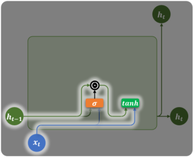
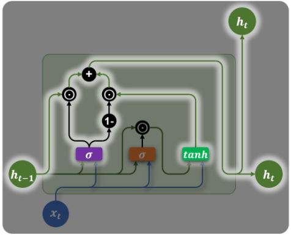

# GRU（门控循环单元）

> GRU（Gated Recurrent Unit）是 LSTM 的简化版本：保留门控思想，**删除 Cell State，合并为 2 个门**，参数更少，训练更快，在多数任务上效果与 LSTM 相当。

## 1. 设计目标

GRU 由 Cho 等人在 2014 年提出，目标是：
- ✅ 保留 LSTM 的**长期依赖建模能力**
- ✅ **减少结构复杂性**（2门 vs 3门，1状态 vs 2状态）
- ✅ **提升训练与推理效率**

## 2. GRU vs LSTM：结构对比

| 对比项 | LSTM | GRU |
|---|---|---|
| **门控数量** | 3（遗忘 + 输入 + 输出） | **2（更新 + 重置）** |
| **内部状态** | $h_t$ + $c_t$（双状态） | **只有 $h_t$（单状态）** |
| **参数量** | 4× 隐藏层大小 | **3× 隐藏层大小** |
| **表达能力** | 更强（复杂长文本） | 接近，略弱 |
| **推理速度** | 慢 | **快** |
| **工程难度** | 复杂 | 简单 |

## 3. 两个门控机制

### 更新门 $z_t$（Update Gate）— 替代 LSTM 的遗忘门+输入门



$$z_t = \sigma(W_z \cdot x_t + U_z \cdot h_{t-1} + b_z)$$

- 输出 $[0, 1]$：控制**保留多少旧记忆 vs 写入多少新信息**
- $z_t \approx 1$：主要保留历史状态（记住远处信息）
- $z_t \approx 0$：主要用新候选状态（忘掉旧信息，专注当前）

### 重置门 $r_t$（Reset Gate）— 控制历史信息的影响



$$r_t = \sigma(W_r \cdot x_t + U_r \cdot h_{t-1} + b_r)$$

- 控制计算**候选状态时，历史 $h_{t-1}$ 的参与程度**
- $r_t \approx 0$：完全忽略历史状态（从零开始处理当前输入）
- $r_t \approx 1$：充分利用历史状态

## 4. 完整公式

### 候选隐藏状态



$$\tilde{h}_t = \tanh(W_h \cdot x_t + U_h \cdot (r_t \odot h_{t-1}) + b_h)$$

- $r_t \odot h_{t-1}$：重置门控制历史信息的保留比例

### 最终输出



$$h_t = (1 - z_t) \odot h_{t-1} + z_t \odot \tilde{h}_t$$

**直觉理解**：
- $(1-z_t)$：从旧记忆中保留多少
- $z_t$：从新候选中接受多少
- 通过"线性插值"混合历史与当前

## 5. 公式汇总

| 组件 | 公式 | 作用 |
|---|---|---|
| **更新门** | $z_t = \sigma(W_z x_t + U_z h_{t-1})$ | 控制新旧信息比例 |
| **重置门** | $r_t = \sigma(W_r x_t + U_r h_{t-1})$ | 控制历史影响程度 |
| **候选状态** | $\tilde{h}_t = \tanh(W_h x_t + U_h(r_t \odot h_{t-1}))$ | 融合当前输入和过滤后的历史 |
| **最终状态** | $h_t = (1-z_t) \odot h_{t-1} + z_t \odot \tilde{h}_t$ | 线性插值混合新旧信息 |

## 6. PyTorch 实现

### 基础 GRU

```python
import torch
import torch.nn as nn

class GRUModel(nn.Module):
    def __init__(self, input_dim, hidden_dim, output_dim, num_layers=1):
        super().__init__()
        self.gru = nn.GRU(
            input_size=input_dim,
            hidden_size=hidden_dim,
            num_layers=num_layers,
            batch_first=True,
            bidirectional=False,
            dropout=0.3 if num_layers > 1 else 0
        )
        self.fc = nn.Linear(hidden_dim, output_dim)
        self.dropout = nn.Dropout(0.3)
    
    def forward(self, x):
        # output: [batch, seq_len, hidden_dim]
        # h_n:    [num_layers, batch, hidden_dim]
        output, h_n = self.gru(x)
        
        # 取最后时间步用于分类
        last_out = output[:, -1, :]
        return self.fc(self.dropout(last_out))

# 使用
model = GRUModel(input_dim=100, hidden_dim=256, output_dim=3)
x = torch.randn(32, 20, 100)
print(model(x).shape)  # [32, 3]
```

### 文本分类完整示例

```python
import torch
import torch.nn as nn

class TextGRU(nn.Module):
    def __init__(self, vocab_size, embed_dim, hidden_dim, output_dim, 
                 num_layers=2, bidirectional=True):
        super().__init__()
        self.embedding = nn.Embedding(vocab_size, embed_dim, padding_idx=0)
        self.gru = nn.GRU(
            embed_dim, hidden_dim,
            num_layers=num_layers,
            batch_first=True,
            bidirectional=bidirectional,
            dropout=0.3
        )
        
        # 双向时输出维度 * 2
        fc_input = hidden_dim * 2 if bidirectional else hidden_dim
        self.fc = nn.Linear(fc_input, output_dim)
        self.dropout = nn.Dropout(0.3)
    
    def forward(self, x):
        # x: [batch, seq_len]（词索引）
        embedded = self.dropout(self.embedding(x))  # [batch, seq, embed]
        output, h_n = self.gru(embedded)
        
        if self.gru.bidirectional:
            # 拼接双向最后隐藏状态
            h = torch.cat([h_n[-2], h_n[-1]], dim=1)  # [batch, hidden*2]
        else:
            h = h_n[-1]   # [batch, hidden]
        
        return self.fc(self.dropout(h))

# 训练循环
model = TextGRU(vocab_size=20000, embed_dim=128, 
                hidden_dim=256, output_dim=5)
optimizer = torch.optim.AdamW(model.parameters(), lr=1e-3)
criterion = nn.CrossEntropyLoss()

# 单步训练
texts = torch.randint(0, 20000, (32, 50))   # [batch=32, seq=50]
labels = torch.randint(0, 5, (32,))

optimizer.zero_grad()
logits = model(texts)
loss = criterion(logits, labels)
loss.backward()
optimizer.step()
print(f"Loss: {loss.item():.4f}")
```

## 7. 适用场景

| 场景 | 是否适合 |
|---|---|
| 短文本分类（评论、微博） | ✅ 非常适合 |
| 嵌入式/手机端推理 | ✅ 轻量高效 |
| 实时流数据处理 | ✅ 低延迟 |
| 小规模语言建模 | ✅ 可用 |
| 大规模预训练模型 | ❌ 用 Transformer |
| 超长序列（>500步） | ❌ 用 Transformer |

## 8. GRU 的局限性

| 局限 | 原因 |
|---|---|
| 长距离依赖仍有限 | 序列极长时仍有信息遗忘 |
| 无法并行 | 时间步依赖限制 GPU 利用率 |
| 不支持大规模预训练 | 生态不如 Transformer 完善 |
| 超长序列表现差 | 100+ 步后记忆衰减 |

## 9. 总结

| 特性 | GRU |
|---|---|
| **提出时间** | 2014（Cho 等人） |
| **核心机制** | 更新门 + 重置门 |
| **状态数量** | 1个（只有 $h_t$） |
| **参数量** | LSTM 的 3/4 |
| **最大优势** | 简单高效，资源友好 |
| **最大局限** | 超长序列不如 Transformer |

**GRU 是 LSTM 和 Transformer 之间的性价比之选——在不需要大模型预训练的场景下，是轻量序列建模的首选。**
