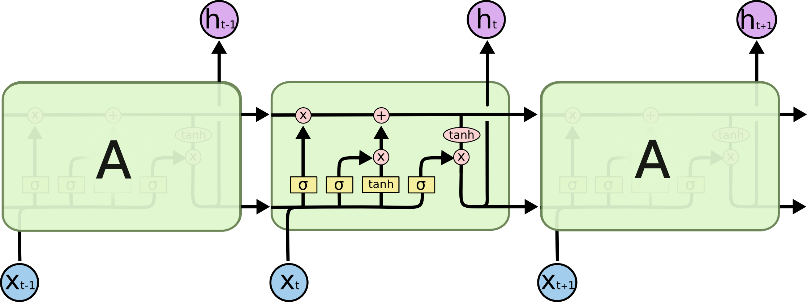
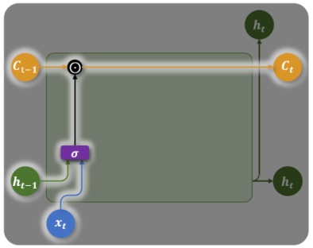
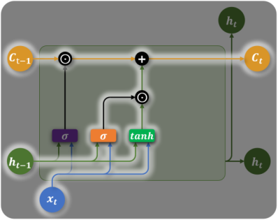
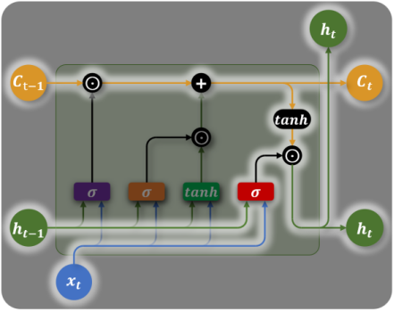

# LSTM（长短期记忆网络）

> LSTM（Long Short-Term Memory）是 RNN 的关键升级版本，通过引入**专用记忆通道（Cell State）和三个门控机制**，解决了 RNN 的长距离依赖问题，成为 Transformer 出现前最强大的序列建模工具。

## 1. 为什么需要 LSTM？

RNN 的致命弱点：**梯度消失**导致无法记住远距离信息。

LSTM 的解决方案：引入两个状态 + 三个"门"：

```
RNN:  仅有 h_t（单一隐藏状态）
LSTM: h_t（短期记忆，对外输出）
      c_t（长期记忆，内部传输高速公路）
```

## 2. LSTM 结构总览



LSTM 在每个时间步维护**两个状态**：
- $h_t$：**隐藏状态**（短期记忆，对外输出）
- $c_t$：**单元状态**（长期记忆，内部高速公路）

核心创新：$c_t$ 通过**加法**更新而非乘法，梯度可以长距离无损传递！

## 3. 三个门控机制详解

### 遗忘门（Forget Gate）— 决定遗忘什么



$$f_t = \sigma(W_f \cdot [h_{t-1}, x_t] + b_f)$$

- 输入：当前输入 $x_t$ + 上一步隐藏状态 $h_{t-1}$
- 输出：$[0, 1]$ 之间的向量（0=完全遗忘，1=完全保留）
- **乘以旧记忆 $c_{t-1}$**，决定哪些历史信息要丢掉

**比喻**：读到新段落的第一句话，决定之前的主语信息是否还有用。

### 输入门（Input Gate）— 决定记住什么



$$i_t = \sigma(W_i \cdot [h_{t-1}, x_t] + b_i)$$

$$\tilde{c}_t = \tanh(W_c \cdot [h_{t-1}, x_t] + b_c)$$

$$c_t = f_t \odot c_{t-1} + i_t \odot \tilde{c}_t$$

- $i_t$：控制**当前信息的写入比例**
- $\tilde{c}_t$：**候选记忆**（当前时间步提取的新信息）
- **单元状态更新**：旧记忆（遗忘后）+ 新信息（写入后）

**关键**：$c_t$ 通过**加法**更新，梯度不消失！

### 输出门（Output Gate）— 决定输出什么



$$o_t = \sigma(W_o \cdot [h_{t-1}, x_t] + b_o)$$

$$h_t = o_t \odot \tanh(c_t)$$

- $o_t$：控制记忆单元中**哪些信息对外输出**
- 对 $c_t$ 压缩到 $(-1, 1)$ 再过滤输出

## 4. 完整公式汇总

| 门控 | 公式 | 作用 |
|---|---|---|
| **遗忘门** | $f_t = \sigma(W_f[h_{t-1}, x_t] + b_f)$ | 决定遗忘旧记忆的比例 |
| **输入门** | $i_t = \sigma(W_i[h_{t-1}, x_t] + b_i)$ | 决定写入新记忆的比例 |
| **候选记忆** | $\tilde{c}_t = \tanh(W_c[h_{t-1}, x_t] + b_c)$ | 当前时间步的候选新信息 |
| **记忆更新** | $c_t = f_t \odot c_{t-1} + i_t \odot \tilde{c}_t$ | **加法更新（关键！）** |
| **输出门** | $o_t = \sigma(W_o[h_{t-1}, x_t] + b_o)$ | 决定当前对外输出的内容 |
| **隐藏状态** | $h_t = o_t \odot \tanh(c_t)$ | 对外输出的短期记忆 |

## 5. 变量维度

| 变量 | 维度 | 含义 |
|---|---|---|
| $x$ | `[batch, seq_len, input_dim]` | 输入序列 |
| $h_t$ | `[batch, hidden_dim]` | 每步隐藏状态（对外输出） |
| $c_t$ | `[batch, hidden_dim]` | 每步单元状态（内部长期记忆） |
| $f_t, i_t, o_t, \tilde{c}_t$ | `[batch, hidden_dim]` | 各门控输出 |

## 6. PyTorch 实现

### 基础使用

```python
import torch
import torch.nn as nn

class LSTMModel(nn.Module):
    def __init__(self, input_dim, hidden_dim, output_dim, num_layers=1):
        super().__init__()
        self.lstm = nn.LSTM(
            input_size=input_dim,
            hidden_size=hidden_dim,
            num_layers=num_layers,
            batch_first=True,
            dropout=0.3 if num_layers > 1 else 0,
            bidirectional=False   # 单向 LSTM
        )
        self.fc = nn.Linear(hidden_dim, output_dim)
        self.dropout = nn.Dropout(0.3)
    
    def forward(self, x):
        # output: [batch, seq_len, hidden_dim]
        # h_n:    [num_layers, batch, hidden_dim]
        # c_n:    [num_layers, batch, hidden_dim]
        output, (h_n, c_n) = self.lstm(x)
        
        # 取最后一个时间步用于分类
        last_output = output[:, -1, :]        # [batch, hidden_dim]
        return self.fc(self.dropout(last_output))

# 使用
model = LSTMModel(input_dim=100, hidden_dim=256, output_dim=2)
x = torch.randn(32, 20, 100)   # [batch=32, seq_len=20, input=100]
out = model(x)
print(out.shape)                # [32, 2]
```

### 双向 LSTM（Bidirectional LSTM）

双向 LSTM 同时从**正向和反向**处理序列，捕获更完整的上下文：

```python
class BiLSTMClassifier(nn.Module):
    def __init__(self, vocab_size, embed_dim, hidden_dim, output_dim):
        super().__init__()
        self.embedding = nn.Embedding(vocab_size, embed_dim)
        self.lstm = nn.LSTM(
            embed_dim, hidden_dim,
            batch_first=True, bidirectional=True  # 双向
        )
        # 双向输出拼接，维度 * 2
        self.fc = nn.Linear(hidden_dim * 2, output_dim)
        self.dropout = nn.Dropout(0.3)
    
    def forward(self, x):
        embedded = self.dropout(self.embedding(x))   # [batch, seq, embed]
        output, (h_n, c_n) = self.lstm(embedded)
        
        # 拼接正向最后 + 反向最后的隐藏状态
        # h_n: [2, batch, hidden]（2 = 双向）
        h_forward  = h_n[0, :, :]   # 正向最后时间步
        h_backward = h_n[1, :, :]   # 反向最后时间步
        h_cat = torch.cat([h_forward, h_backward], dim=1)   # [batch, hidden*2]
        
        return self.fc(self.dropout(h_cat))

model = BiLSTMClassifier(vocab_size=10000, embed_dim=128, 
                         hidden_dim=256, output_dim=3)
```

### 多层堆叠 LSTM

```python
# 2 层 LSTM，隐藏层之间加 Dropout
lstm = nn.LSTM(
    input_size=100,
    hidden_size=256,
    num_layers=2,       # 堆叠层数
    batch_first=True,
    dropout=0.3         # 层间 Dropout
)
```

## 7. LSTM 的局限性

### 三大核心缺陷

| 缺陷 | 原因 | Transformer 的改进 |
|---|---|---|
| **无法并行** | $h_t$ 依赖 $h_{t-1}$，必须串行计算 | 自注意力：全序列并行 |
| **仍有长距离遗忘** | 100+ 步后仍有信息衰减 | Attention 直接建模任意两点关系 |
| **计算复杂** | 每步 4 个全连接（4× RNN 参数量） | 虽然参数多但可并行化 |

**"LSTM 是设计精巧的蒸汽机，Transformer 是新时代的电力引擎。"**

### 何时还使用 LSTM？

- 实时推理（Transformer 计算延迟高）
- 资源受限的边缘设备
- 短序列任务（< 200 步）
- 时间序列预测（不需要预训练的场景）

## 8. RNN vs LSTM vs Transformer

| 对比 | RNN | LSTM | Transformer |
|---|---|---|---|
| **状态** | $h_t$ | $h_t + c_t$（双状态） | 无序列状态（全局注意力） |
| **长依赖** | 差 | 中等（<100步） | **强（任意长度）** |
| **并行性** | ❌ | ❌ | ✅ |
| **梯度消失** | 严重 | 缓解 | **无问题** |
| **主流地位** | 已基本淘汰 | 特定场景使用 | **当前主流** |

## 总结

| 特性 | LSTM |
|---|---|
| **提出时间** | 1997（Hochreiter & Schmidhuber）|
| **核心创新** | Cell State + 三门控（遗忘/输入/输出）|
| **关键优势** | 加法更新记忆，解决梯度消失 |
| **主要弱点** | 无法并行，长序列仍有遗忘 |
| **典型应用** | 机器翻译（Pre-Transformer时代），时序预测 |
