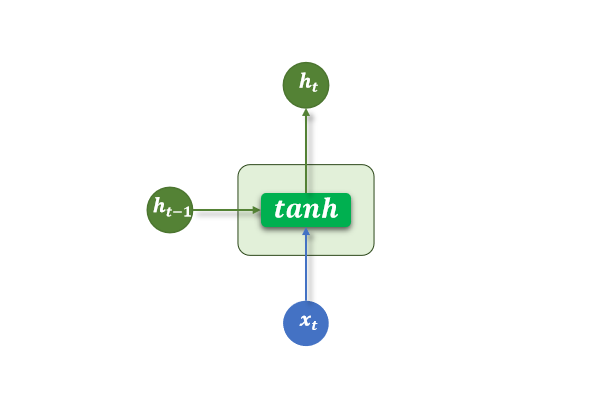
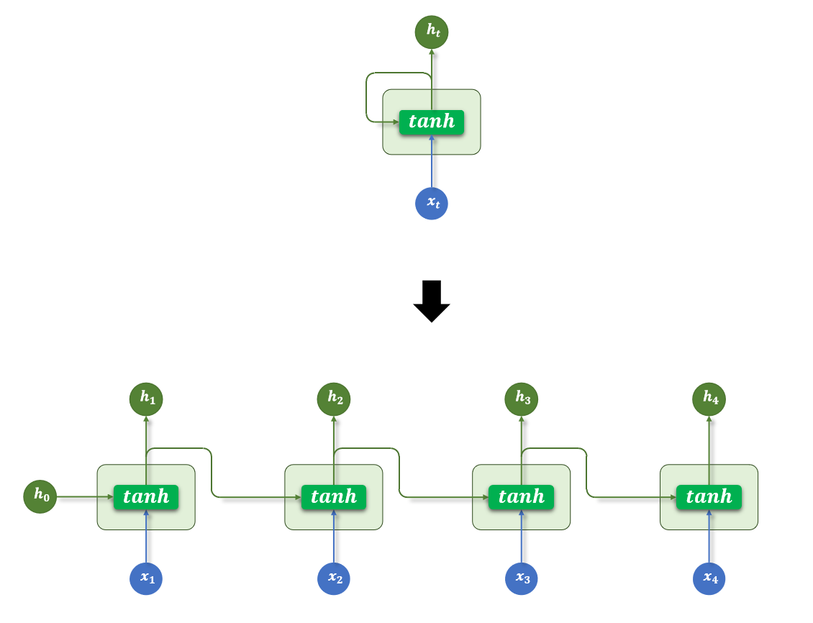

# 循环神经网络 RNN

> RNN（Recurrent Neural Network）是处理**序列数据**的第一代神经网络架构，通过引入"记忆"（隐藏状态），让网络感知上下文，是 LSTM、GRU、Seq2Seq 的起点。

## 1. 为什么需要 RNN？

传统 FNN 只能处理**定长向量**，无法处理"有顺序关系"的数据：

- 句子 "我爱北京"—— 每个词的含义依赖上下文
- 时间序列——今天的股价依赖昨天
- 语音——当前音素依赖之前的发音

**RNN 的解决方案**：引入**时间步（Time Step）**，每个位置不只看当前输入，还考虑"过去发生的内容"。

## 2. 什么是时间步？

对于序列输入 $x = [x_1, x_2, x_3, \ldots, x_T]$（如一句话的 $T$ 个词），RNN 按顺序处理每个元素，每处理一个就是"走过了一个时间步"。

```
时间步:  t=1    t=2    t=3    ...   t=T
输入:    x₁     x₂     x₃           xT
         ↓      ↓      ↓             ↓
状态:   h₁ → h₂  →  h₃  → ... → hT
```

## 3. 核心数学公式

$$h_t = f(W_x \cdot x_t + W_h \cdot h_{t-1} + b)$$

| 符号 | 含义 |
|---|---|
| $x_t$ | 第 $t$ 个时间步的输入（如词向量） |
| $h_t$ | 当前时间步的**隐藏状态**（记忆） |
| $h_{t-1}$ | 上一时间步的隐藏状态（历史记忆） |
| $W_x$ | 输入权重矩阵 |
| $W_h$ | 隐藏状态权重矩阵 |
| $f$ | 激活函数（通常是 $\tanh$） |

## 4. 结构图

**单步结构**：



**时间展开图**（一个 RNN 沿时间步展开为多个）：



```
x = [x1, x2, x3, ..., xT]   # 输入序列

每个时间步共享相同的参数 Wx, Wh, b：

          ┌────┐       ┌────┐       ┌────┐
x₁ ──→  │ h₁ │ ──→   │ h₂ │ ──→   │ h₃ │ ... ──→ hT
          └────┘       └────┘       └────┘
```

**关键特点：参数共享**——所有时间步使用同一套参数，所以 RNN 能处理任意长度的序列。

## 5. 变量维度详解

假设：
- `batch_size = 32`，`seq_len = 10`，`input_dim = 100`，`hidden_dim = 128`

| 变量 | 维度 | 含义 |
|---|---|---|
| `x` | `[32, 10, 100]` | 32 个样本，每个 10 个词，每词 100 维向量 |
| `h0` | `[1, 32, 128]` | 初始隐藏状态（通常全 0） |
| `output` | `[32, 10, 128]` | 所有时间步的隐藏状态 |
| `hn` | `[1, 32, 128]` | 最后一个时间步的状态 |

## 6. PyTorch 实现

### 基础 RNN

```python
import torch
import torch.nn as nn

class RNNModel(nn.Module):
    def __init__(self, input_dim, hidden_dim, output_dim, num_layers=1):
        super().__init__()
        self.rnn = nn.RNN(
            input_size=input_dim,
            hidden_size=hidden_dim,
            num_layers=num_layers,
            batch_first=True,    # 输入格式: [batch, seq_len, input_dim]
            dropout=0.3 if num_layers > 1 else 0
        )
        self.fc = nn.Linear(hidden_dim, output_dim)
    
    def forward(self, x):
        # out:  [batch, seq_len, hidden_dim]
        # h_n:  [num_layers, batch, hidden_dim]
        out, h_n = self.rnn(x)
        
        # 取最后一个时间步的输出用于分类
        last_hidden = out[:, -1, :]     # [batch, hidden_dim]
        return self.fc(last_hidden)     # [batch, output_dim]

# 使用示例
model = RNNModel(input_dim=100, hidden_dim=128, output_dim=2)
x = torch.randn(32, 10, 100)    # [batch=32, seq_len=10, features=100]
output = model(x)
print(output.shape)              # torch.Size([32, 2])
```

### 文本情感分类示例

```python
import torch
import torch.nn as nn

class SentimentRNN(nn.Module):
    def __init__(self, vocab_size, embed_dim, hidden_dim, output_dim, pad_idx):
        super().__init__()
        self.embedding = nn.Embedding(vocab_size, embed_dim, padding_idx=pad_idx)
        self.rnn = nn.RNN(embed_dim, hidden_dim, batch_first=True)
        self.fc = nn.Linear(hidden_dim, output_dim)
        self.dropout = nn.Dropout(0.3)
    
    def forward(self, text):
        # text: [batch, seq_len]（词索引）
        embedded = self.dropout(self.embedding(text))  # [batch, seq_len, embed_dim]
        output, hidden = self.rnn(embedded)            # hidden: [1, batch, hidden]
        
        hidden = hidden.squeeze(0)                     # [batch, hidden]
        return self.fc(self.dropout(hidden))           # [batch, output_dim]

# 二分类（正面/负面情感）
model = SentimentRNN(
    vocab_size=10000, embed_dim=100, 
    hidden_dim=256, output_dim=1, pad_idx=0
)
```

## 7. RNN 的三种输出模式

| 模式 | 输出 | 使用场景 |
|---|---|---|
| **多对一** | 最后时间步 $h_T$ | 文本分类、情感分析 |
| **多对多（等长）** | 所有时间步 $h_1, \ldots, h_T$ | 序列标注（命名实体识别）|
| **多对多（变长）** | 通过 Seq2Seq | 机器翻译 |

```python
out, h_n = rnn(x)

# 多对一：取最后时间步
pred = fc(out[:, -1, :])

# 多对多（等长）：对每个时间步做分类
pred = fc(out)  # [batch, seq_len, output_dim]
```

## 8. RNN 的局限：梯度消失与长距离遗忘

### 问题本质

RNN 的反向传播需要沿时间步传递梯度（BPTT，Back Propagation Through Time）。每个时间步都要乘以 $\tanh'(z)$（最大值 1，通常更小），经过 $T$ 步后：

$$\frac{\partial L}{\partial h_1} = \frac{\partial L}{\partial h_T} \cdot \prod_{t=2}^{T} \frac{\partial h_t}{\partial h_{t-1}}$$

若每步梯度 < 1，$T=100$ 步后梯度趋近于 0 → **底层参数无法更新**

### 直觉理解

句子"今天天气不错，我去公园玩，那个地方风景很美……100个词之后……它明天还会这么美吗？"

RNN 在处理"它"时，已经几乎忘记了"那个地方"，因为"那个地方"的信息在经过 100 步传递后，梯度消失殆尽。

| 问题 | 原因 | 解决方案 |
|---|---|---|
| 梯度消失 | 梯度连乘趋近于 0 | LSTM / GRU |
| 梯度爆炸 | 梯度连乘趋近于无穷 | 梯度裁剪 |
| 长距离遗忘 | 远处的梯度传不回来 | LSTM 门控机制 |

## 9. FNN vs RNN

| 特征 | FNN | RNN |
|---|---|---|
| **输入结构** | 定长向量 | 任意长序列 |
| **参数共享** | 否 | ✅ 是（所有时间步共享一套参数） |
| **顺序感知** | 无 | ✅ 有 |
| **记忆能力** | 无 | 短期记忆 |
| **处理速度** | 快（可并行） | 慢（必须串行） |

## 总结

| 特性 | RNN |
|---|---|
| **核心公式** | $h_t = \tanh(W_x x_t + W_h h_{t-1} + b)$ |
| **参数共享** | 是（权重在所有时间步共用） |
| **记忆机制** | 隐藏状态 $h_t$ |
| **主要弱点** | 梯度消失，长距离依赖差 |
| **替代方案** | LSTM（门控记忆）、GRU（简化门控）、Transformer（注意力机制） |
